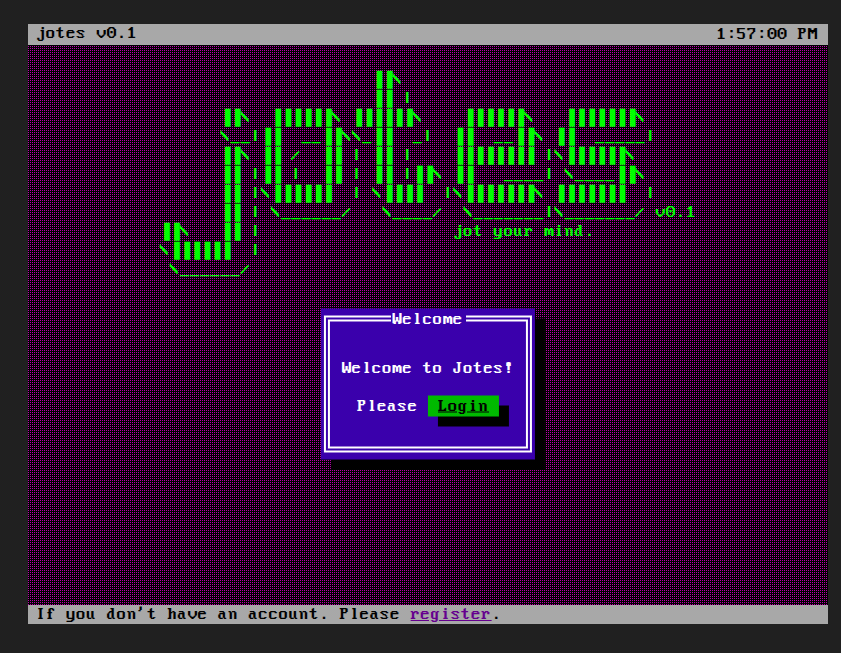
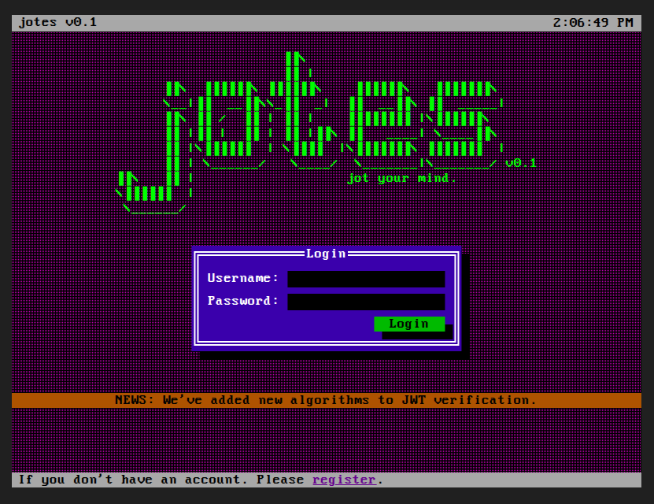
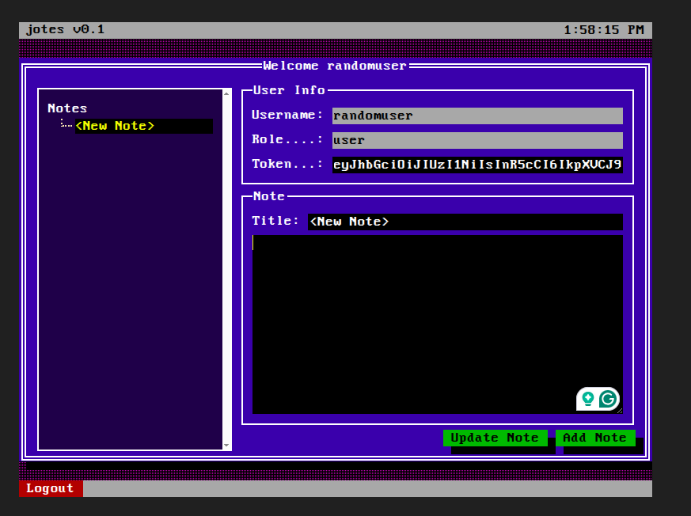
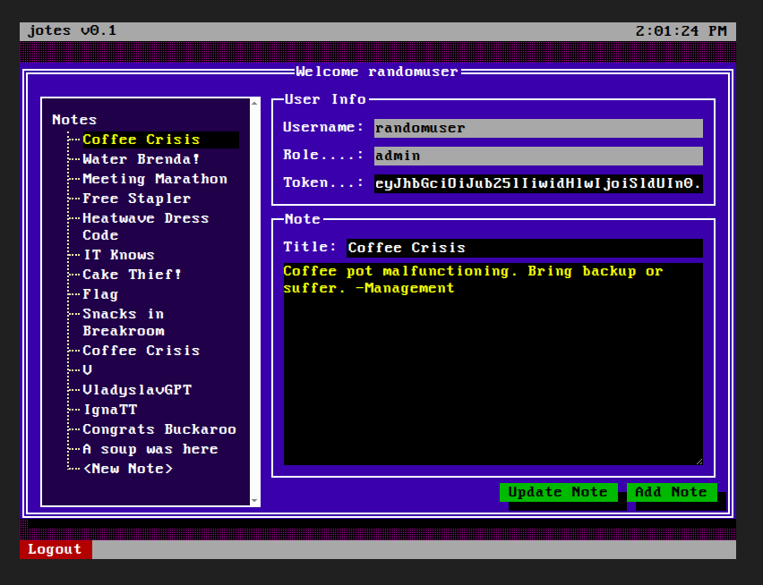

# Jotes

> Welcome to our note taking app, I hope you can't see what we're writing





"NEWS: We've added new algorithms to JWT verification" hmm..interesting. Reminds of the ["none" algorithm attack in JWTs](../Cryptohack/Crypto%20on%20the%20Web/JSON%20Web%20Tokens.md)

After registering and then logging in:



Decoding the JWT shown on screen (it is saved as "auth_token" Cookie), we get:

1. Header:

    ```json
    {
        "alg": "HS256",
        "typ": "JWT"
    }
    ```

2. Payload:

    ```json
    {
        "user_id": 43,
        "role": "user",
        "username": "randomuser"
    }
    ```

Change **alg** to "none" and **role** to "admin", encode to create a JWT. Edit the cookie and reload.

We get *Error: It says you are an admin. But your id can't be an admin?*

Yep, we're close!

Create another JWT with **user_id** as 1



We're in! Read the note titled "Flag"

> JWT decoding and encoding at: https://jwt.io/
