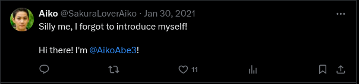
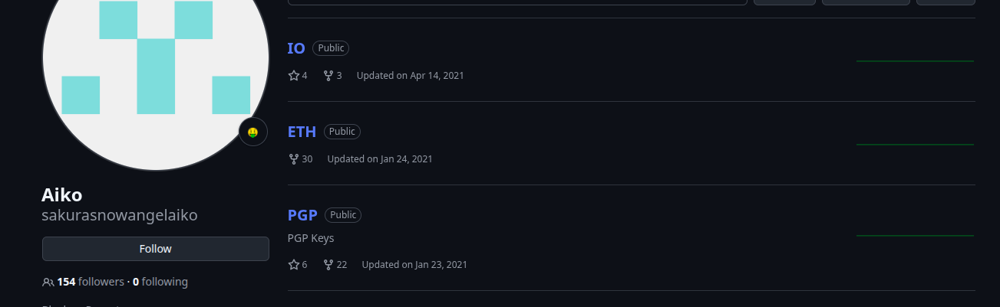
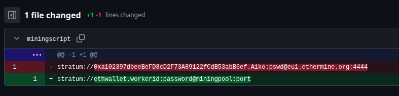
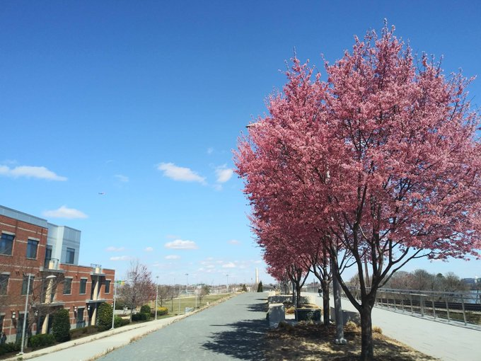
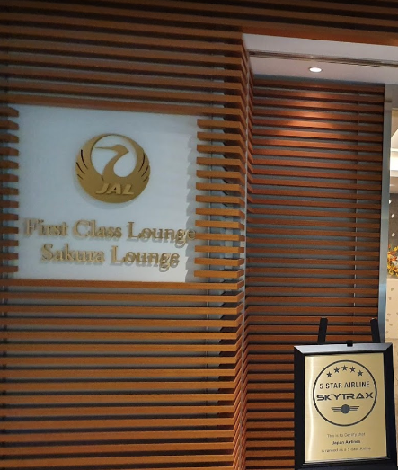
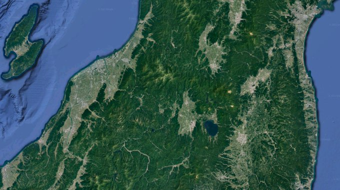

# Sakura

## TIP-OFF

We are given a SVG, and we have to answer the question: What username does the attacker go by?

```shell
exiftool sakurapwnedletter.svg
.
.
Export-filename                 : /home/SakuraSnowAngelAiko/Desktop/pwnedletter.png
.
.
```

Answer: **SakuraSnowAngelAiko**

## RECONNAISANCE

1. What is the full email address used by the attacker?
2. What is the attacker's full real name?

Google search results of "SakuraSnowAngelAiko":


Scrolling through the twitter posts, we get:



Answer-2: **Ako Abe**

The github profile:



In the PGP repo,there's a PGP public key. Base64-decoding it gives us the Answer-1: **SakuraSnowAngel83@protonmail.com**

## UNVEIL

1. What cryptocurrency does the attacker own a cryptocurrency wallet for?
2. What is the attacker's cryptocurrency wallet address?
3. What mining pool did the attacker receive payments from on January 23, 2021 UTC?
4. What other cryptocurrency did the attacker exchange with using their cryptocurrency wallet?

The latest commit in ETH repo:



Searching the given address takes us to https://etherscan.io/address/0xa102397dbeeBeFD8cD2F73A89122fCdB53abB6ef

Hence, Answer-1: **Ethereum** and Answer-2: **0xa102397dbeeBeFD8cD2F73A89122fCdB53abB6ef**

Observing the transactions list on etherscan, we get the Answer-3: **Ethermine** and Answer-4: **Tether**

## TAUNT

1. What is the attacker's current Twitter handle?
2. What is the BSSID for the attacker's Home WiFi?

We already know Answer-1: **SakuraLoverAiko**

Answer-2: ???

## HOMEBOUND

1. What airport is closest to the location the attacker shared a photo from prior to getting on their flight?
2. What airport did the attacker have their last layover in?
3. What lake can be seen in the map shared by the attacker as they were on their final flight home?
4. What city does the attacker likely consider "home"?



Zooming into the picture, Washingtom Moument can be seen. The nearest airport is Ronald Reagan Washington National Airport, which gives us the Answer-1: **DCA**



Jal First Class Lounge is located at Haneda Airport, which gives us the Answer-2: **HND**



Google Lens search gives us the Answer-3: **Lake Inawashiro**

Answer-4: ???
