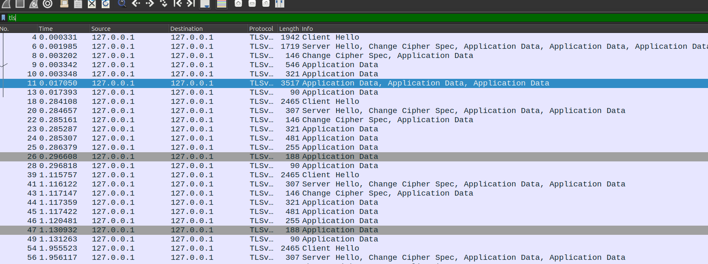
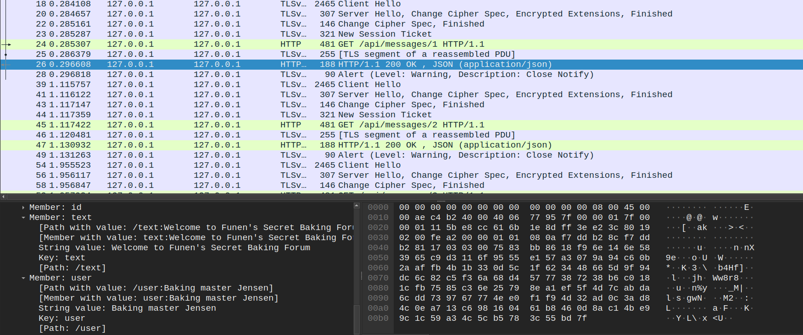
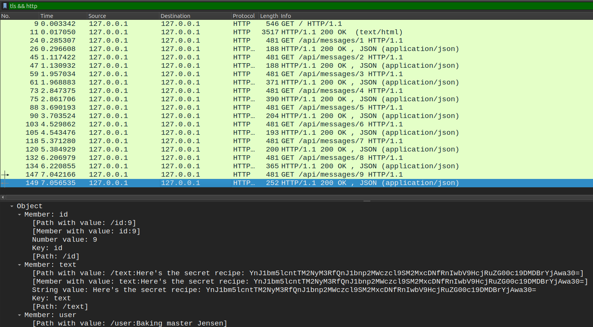

# The Secret Brunsviger

> Forensics

```text
I have intercepted encrypted HTTPS traffic from the secret brunsviger baking forum, but I need help decrypting it.
```

points: `50`

solves: `242`

author: `Ha1fdan`

---

`traffic.pcap` and `keys.log` given:

Open Wireshark to observe the pcap file:



In Preferences, set TLS keys using the log file given. Now Application Data is visible:



The JSON packets seem interesting...



Decode (base64) the secret recipe to get the flag
