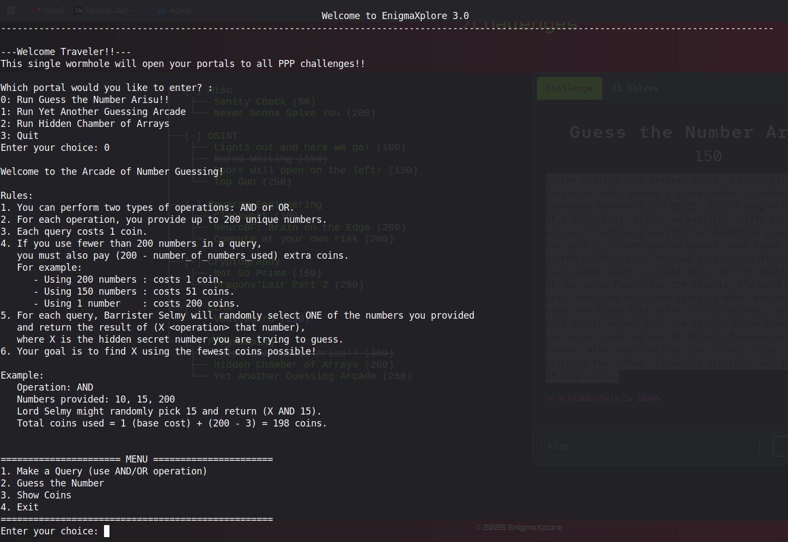

# Guess the Number Arisu!!

## Description

```text
In the endless dark between stars, a celestial knight named Barrister Selmy guards a secret code, a number hidden somewhere between 0 and
65535, buried deep within the fabric of a black hole. Arisu, an explorer adrift in the void, must uncover it while conserving her dwindling
energy coins. She can send up to 200 quantum probes, each tuned to emit either an AND or OR signal, encoded with unique frequency numbers.
Every probe costs a single coin. Yet the emptiness is cruel, if she sends fewer than 200 signals, the void consumes the rest, draining her
coins equal to what remains unused. Each time, the black hole stirs, and Lord Selmy, or perhaps the worm within echoes back the result of the
operation between the secret code and one of Arisu’s frequencies, chosen at random. With every whisper, she inches closer to decoding the truth
of the number, balancing precision and loss in the abyss of deep space.
```



## Approach

First thought: try OR operation with 200 0's. But this showed an error saying all input integers must be different.

From the description, we know that the hidden number is *between 0 and 65535*, which means the number **doesn't have more than 16 bits**.

Our input is integers, which can certainly be more than 16 bits.

Idea: Input 200 such numbers whose lowest 16 bits are unset. Taking OR with any of these numbers and then extracting just the 16 bits will give the hidden number.

## Solve Script

```python
from pwn import *

nums = set()
while len(nums) < 200:
    # Random 30-bit integer, zero out lower 16 bits
    n = (random.randint(0, (1 << 30) - 1) >> 16) << 16
    nums.add(n)

r = remote("0.cloud.chals.io", 15985)
r.recvuntil(b"Enter your choice: ")
r.sendline(b"0")
r.recvuntil(b"Enter your choice: ")
r.sendline(b"1")
r.recvuntil(b"Enter operation type (1 for AND, 2 for OR): ")
r.sendline(b"2")
r.recvuntil(b"Enter up to 200 unique numbers (end with -1):\n")

payload = b""
for i in nums:
    payload += str(i).encode() + b" "
payload += b"-1"

r.sendline(payload)
s = r.recvline()
# print(s)
num = int(s.decode().strip().split()[-1])
num &= 0xFFFF # extract 16 lower bits
print(num)
r.recvuntil(b"Enter your choice: ")
r.sendline(b"3")
s = r.recvline()
print(s)
r.recvuntil(b"Enter your choice: ")
r.sendline(b"2")
r.recvuntil(b"Enter your guess: ")
r.sendline(str(num).encode())
s = r.recvline()
print(s)
```
