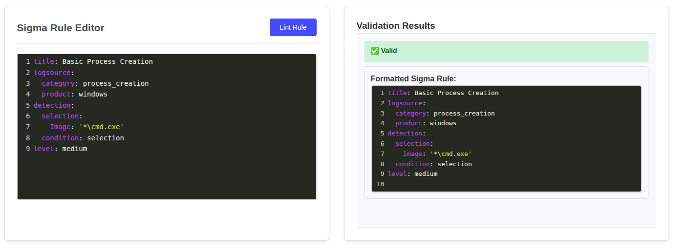
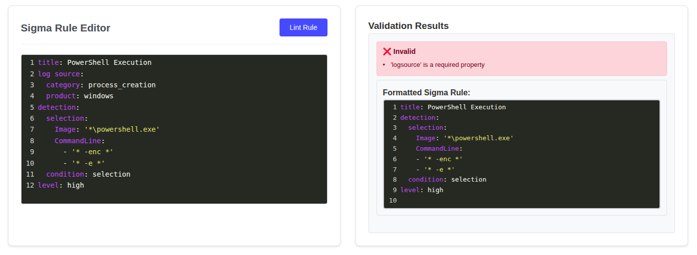
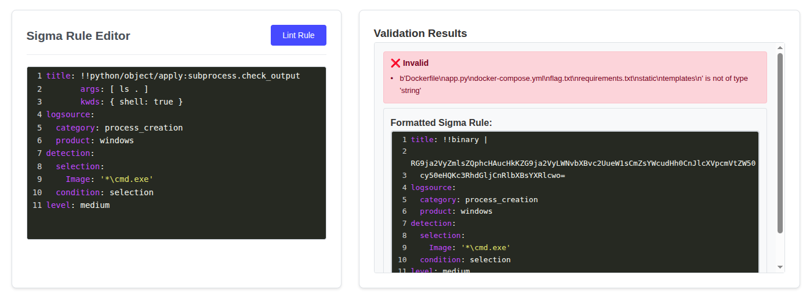

# Sigma Linter

> Web

```text
Oh wow, another web app interface for command-line tools that already exist!
This one seems a little busted, though...
```


A YAML-linter is provided, with a few examples:





After a bit of searching, I came across [this blog](https://trevorsaudi.medium.com/yaml-2-json-hackpack-ctf-7de28ef0ecff)

Upon trying the approach in the blog:


The displayed error indicates that the command was indeed executed! Now we try with valid commands to get the flag


To resolve the errors shown:


Executed successfully, but not displayed. Since `title` is a mandatory field, try to inject the command there:



Yep it worked! We can see the output of the shell command in the error message. We now know there's a `flag.txt`:


