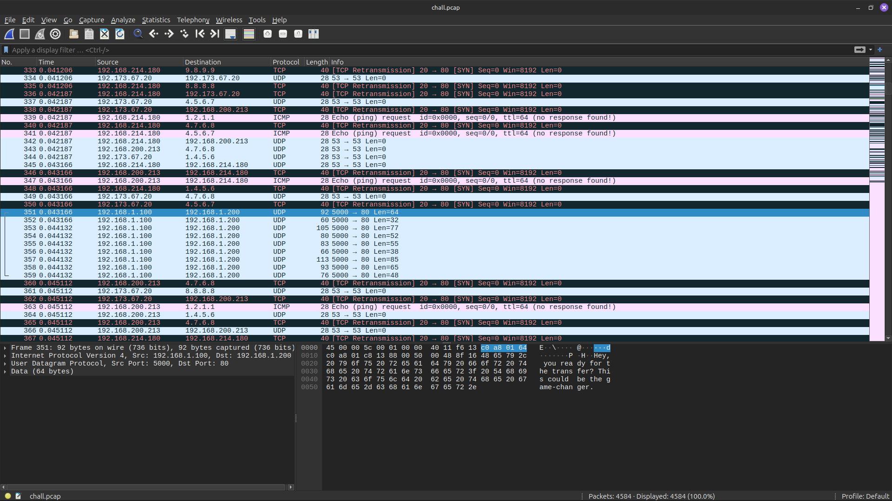
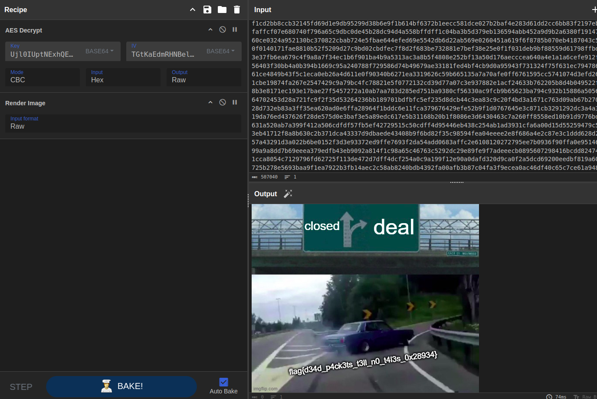

# Last Transmission

> Forensics - Easy

**Description**: Late one evening, network logs recorded a brief but unusual exchange. A terse message, filled with urgency and hints of a one-time secret transfer, appeared alongside an otherwise ordinary packet. The dialogue was short, leaving more questions than answers. What was really sent that night? The clues are subtle—if you know where to look.



Extract the messages from the UDP stream:

```shell
tshark -r chall.pcap -Y "ip.dst == 192.168.1.200 and udp" -T fields -e udp.payload | xxd -r -p
> Hey, you ready for the transfer? This could be the game-changer.Always ready. Just say the word.This is high-stakes. I'm sending it once, and once 
only. Don't screw this up.The area is crawling with eyes. It's gonna be tight.Our paths might cross again, but it'll be on our terms.This ends tonight, 
one way or another.Here’s the key, encrypted and waiting: Ujl0IUptNExhQEJxWGUyUG8jV2MlVXlOczdEa0h2WmY=And don’t forget this—keep it close: 
TGtKaEdmRHNBelhjVmJObQ==You know the drill. Good luck. You’ll need it.
```

These may be parameters for AES:

```text
Key: Ujl0IUptNExhQEJxWGUyUG8jV2MlVXlOczdEa0h2WmY=
IV: TGtKaEdmRHNBelhjVmJObQ==
```

But what to decrypt? There are a lot of ICMP packets. [Reference writeup](https://github.com/kossiitkgp/ctf-writeups/blob/master/WorldWideCTF%2Ffor%2Ftoo_hidden%2FREADME.md) \
Extract the data bytes from the ICMP packets:

```shell
tshark -Y "ip.dst == 192.168.1.200 && icmp.type==8" -T fields -e data.data -r chall.pcap | awk '{printf "%s", $1}'
```

Using Cyberchef, AES Decrypt these bytes using the Key and IV found above \
The raw output has a **PNG header**; render the image, which showed the flag!


