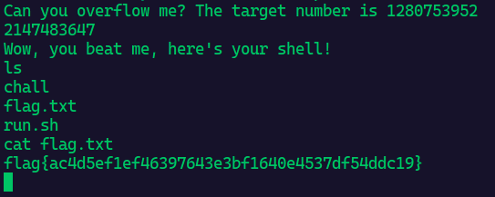

# Ultra-Safe-Integers

> Pwn - Easy

**Description**: Surely, overflows are just a string problem, aren’t they?

```c
#include <stdio.h>
#include <stdlib.h>
#include <sys/types.h>
#include <unistd.h>
#include <time.h>

//gcc -m32 -fno-stack-protector -no-pie chall.c -o chall

void init()
{
    setvbuf(stdin,NULL,_IONBF,0);
    setvbuf(stdout,NULL,_IONBF,0);
    setvbuf(stderr,NULL,_IONBF,0);
    alarm(60);
}

void win()
{
    system("/bin/sh");
}
 
int main()
{
    init();
    srand(time(0));
    int a = rand();
    int input;
    printf("Can you overflow me? The target number is %d\n",a);
    scanf("%d", &input);
    if(input < 0)
    {
        puts("Nice try! If it was that easy even I could have cracked it!");
        exit(0);
    }
    int value = a + input;
    if(value < a)
    {
        puts("Wow, you beat me, here's your shell!");
        win();
    }
    else
    {
        puts("Well, that didn't work. Try again!");
    }
    return 0;
}
```

This is clearly an integer overflow problem


