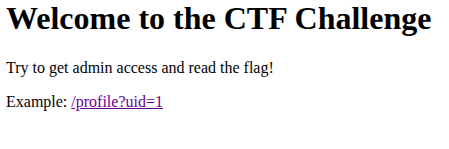
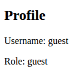
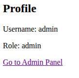
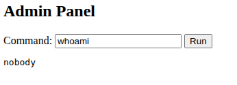

# A easy web

## Files Provided

`Dockerfile`:

```dockerfile
FROM python:3.11-slim

WORKDIR /app

COPY requirements.txt .
RUN pip install --no-cache-dir -r requirements.txt

# 複製程式碼
COPY . .

RUN mkdir -p /app/.hidden && \
    mv /app/flag.txt /app/.hidden/flag-$(cat /dev/urandom | tr -dc 'a-zA-Z0-9' | fold -w 32 | head -n 1).txt && \
    chown -R nobody:nogroup /app

EXPOSE 5000

USER nobody

CMD ["python", "app.py"]
```

## Approach

`/`:



`/profile?uid=1`:



Tried running a script to check all uids from 1 to 100 -> no luck

Guessed `1337` (because of its [significance](https://en.wikipedia.org/wiki/Leet)), and it worked!



Clicking on admin panel, we are taken to `/admin?cmd=whoami&uid=1337`:



Typing commands in the text box and clicking "Run" gives "Access Denied". But providing commands in query params works!

Using `ls -a` commands, found out the random name of the flag file and then `cat` it
