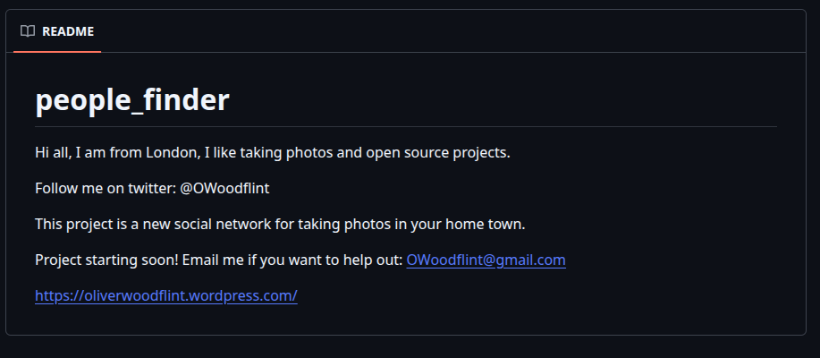
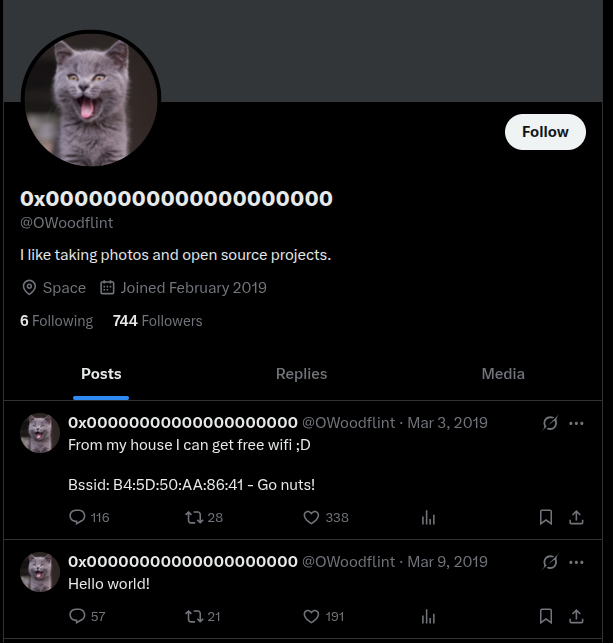
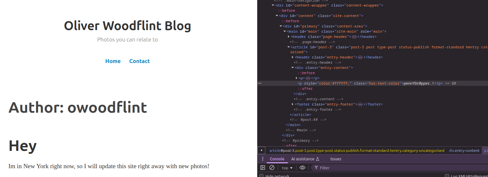

# OhSINT

We are given an image (of Windows XP wallpaper) and have to answer the following:

1. What is this user's avatar of?
2. What city is this person in?
3. What is the SSID of the WAP he connected to?
4. What is his personal email address?
5. What site did you find his email address on?
6. Where has he gone on holiday?
7. What is the person's password?

```shell
exiftool WindowsXP_1551719014755.jpg
.
.
GPS Latitude                    : 54 deg 17' 41.27" N
GPS Longitude                   : 2 deg 15' 1.33" W
Copyright                       : OWoodflint
.
.
```

Entering these coordinates on https://www.gps-coordinates.net/ takes us to **New York**, which is *Answer-6*

Google search results of "OWoodflint":


The github repo:



This gives us *Answers-2,4,5*

The twitter profile:



This gives us *Answer-1*. Using [geowifi](https://github.com/GONZOsint/geowifi) or simply [WiGLE](https://wigle.net/index), we get SSID "UnileverWiFi", which is *Answer-3*

The wordpress blog:



This again gives us the *Answer-6*. And upon inspecting the HTML, we get the *Answer-7*

The Answers:

1. cat
2. London
3. UnileverWiFi
4. OWoodflint@gmail.com
5. Github
6. New York
7. pennYDr0pper.!