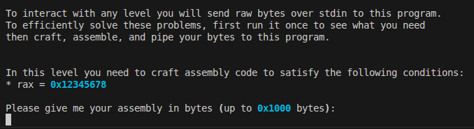
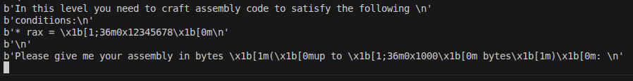

# Pwntools Tutorial

## level 1.0

```c
int bypass_me(char *buf)
{
    unsigned int magic = 0xdeadbeef;

    if (!strncmp(buf, (char *)&magic, 4)) {
        return 1;
    }

    return 0;
}
```

```python
from pwn import *

context(arch="amd64", os="linux", log_level="info")

challenge_path = "/challenge/pwntools-tutorials-level1.0"
p = process(challenge_path)

payload = p64(0xdeadbeef)+b"\n"
p.sendafter(b":)\n###\n", payload)

flag = p.recvline()
print(f"flag is: {flag}")
```

## level 1.1

```c
int bypass_me(char *buf)
{
    int flag = 1;
    int num;

    if (buf[0] != 'p' || buf[1] != 0x15) {
        flag = 0;
        goto out; 
    }

    memcpy(&num, buf + 2, 4);
    if (num != 123456789) {
        flag = 0;
        goto out;
    }

    if (strncmp(buf + 6, "Bypass Me:)", 11)) {
        flag = 0;
        goto out;
    }

out:
    return flag;
}
```

```python
from pwn import *

context(arch="amd64", os="linux", log_level="info")

challenge_path = "/challenge/pwntools-tutorials-level1.1"
p = process(challenge_path)

payload = b"p"
payload += p8(0x15)
payload += p32(123456789)
payload += b"Bypass Me:)"
payload += b"\n"
p.sendafter(b":)\n###\n", payload)

flag = p.recvline()
print(f"flag is: {flag}")
```

## level 2.0



```python
while True:
    print(p.recvline())
```



```python
from pwn import *

def print_lines(io):
    info("Printing io received lines")
    while True:
        try:
            line = io.recvline()
            success(line)
        except EOFError:
            break

context(arch="amd64", os="linux", log_level="info")

challenge_path = "/challenge/pwntools-tutorials-level2.0"
p = process(challenge_path)

payload = asm("mov rax, 0x12345678")

p.sendafter(b'Please give me your assembly in bytes \x1b[1m(\x1b[0mup to \x1b[1;36m0x1000\x1b[0m bytes\x1b[1m)\x1b[0m: \n', payload)
print_lines(p)
```

## level 2.1

```text
In this level you need to craft assembly code to satisfy the following 
conditions:
* exchange the value of rax and rbx
```

```python
payload = asm("xchg rax, rbx")
```

## level 2.2

```text
In this level you need to craft assembly code to complete the following 
operations:
* rax = rax % rbx + rcx - rsi

We already set the following in preparation for your code:
rdx = 0
```

```python
payload = asm("div rbx") # computes (rdx:rax) / rbx → quotient in rax, remainder in rdx
payload += asm("mov rax, rdx") # rax = rax % rbx
payload += asm("add rax, rcx") # rax = rax % rbx + rcx
payload += asm("sub rax, rsi") # rax = rax % rbx + rcx - rsi
```

## level 2.3

```text
In this level you need to craft assembly code to complete the following 
operations:
* copy 8-bytes memory starting at 0x404000 to 8-bytes memory starting at 
0x405000
```

```python
payload = asm("""
    mov rax, [0x404000]
    mov [0x405000], rax
""")
```

## level 2.4

```text
In this level you need to craft assembly code to complete the following 
operations:
* the top value of the stack = the top value of the stack - rbx

Tips: perfer push and pop instructions, other than directly  dereference
```

```python
payload = asm("""
    pop rax
    sub rax, rbx
    push rax
""")
```

## level 2.5

```text
In this level you need to craft assembly code to complete the following 
operations:
* the top value of the stack = abs(the top value of the stack)
```

```python
payload = asm("""
    pop rax
    test rax, rax
    jns done
    neg rax
done:
    push rax
""")
```

## level 2.6

```text
In this level you need to craft for statement to complete the following 
operations:
* rax = the sum from 1 to rcx
```

```python
payload = asm("""
    xor rax, rax
    mov rbx, 1
loop_start:
    cmp rbx, rcx
    jg loop_end
    add rax, rbx
    inc rbx
    jmp loop_start
loop_end:
""")
```
